# Manual de implantação · Kit de Gestão para Advogados

Versão 1.0 · setembro de 2026 · Seu Sócio Gestor

Este manual é para ser lido uma vez, em 20 minutos, e consultado depois. Ele explica o método
(cinco núcleos, um fechamento por semana), organiza a implantação em quatro semanas com as 20
planilhas distribuídas, mostra o que cada planilha faz, ensina a usar a IA sem expor cliente nem
processo e fecha com a rotina de segunda, de sexta, do dia 5 e do fim do trimestre. As 8 aulas em
vídeo mostram tudo isso na tela; o manual é o mapa.

Uma frase antes de começar: **o kit organiza a gestão do escritório, não o direito.** Nada aqui
calcula prazo processual, sugere tese ou produz peça. As planilhas avisam; a conferência do prazo
na fonte oficial, a estratégia e a conversa com o cliente continuam sendo suas.

## 1. O que você recebeu

| Arquivo | O que é | Tempo |
|---|---|---|
| 01 a 04 | Núcleo Prazos: Agenda de prazos, Andamento por processo, Rotina da semana, Checklist de abertura e encerramento | 12 min na segunda |
| 05 a 08 | Núcleo Honorários: Custo-hora, Simulador de honorários, Proposta de honorários, Tabela de referência | 20 min na primeira proposta, 5 nas seguintes; revisão trimestral |
| 09 a 12 | Núcleo Caixa: Caixa do escritório, Provisão de impostos, 13º e férias, Pró-labore e separação PF × escritório, Reserva e metas de caixa | parte dos 18 min de sexta; 1 hora no dia 5 |
| 13 a 16 | Núcleo Carteira: Carteira de clientes e casos, Parcelas e inadimplência, Funil de propostas, Horas por caso e por pessoa | parte dos 18 min de sexta; 2 min por dia para as horas |
| 17 a 20 | Núcleo Painel: Painel do escritório, Resultado mensal, Metas do trimestre, Resumo do mês para a IA e para o contador | parte dos 18 min de sexta; 30 min no dia 5 |
| 21 | Biblioteca de 40 prompts do escritório (5 grupos de 8: Prazos, Honorários, Caixa, Clientes, Painel), PDF e txt | 5 min por prompt |
| 22 | Bônus: 15 mensagens de cobrança e confirmação (e-mail e WhatsApp) | 2 min por mensagem |
| 23 | Bônus: Guia LGPD para o escritório pequeno | 30 min, uma vez |
| 24 | Bônus: Roteiro da reunião mensal com o contador | 30 min por mês |
| 25 | Checklists: abertura de caso, fechamento do mês, antes de enviar a proposta | 2 min cada |
| 26 | Este manual | 20 min, uma vez |
| 27 a 29 | Modelos de apresentação (.pptx): resultado do mês (8 slides), proposta de honorários (10), carteira para o contador (8) | 20 min por apresentação |
| videos/ | 8 aulas de 2 a 3 minutos, tela real, narração e legenda | 20 min no total |

**As 8 aulas (pasta videos/, em mp4 com legenda .srt).** Assista na ordem; cada semana da
implantação diz qual aula ver.

| Aula | Título | Duração | Planilhas |
|---|---|---|---|
| 1 | Antes de abrir a planilha: os cinco núcleos e a rotina | 2:28 | método e 03 |
| 2 | Agenda de prazos e andamento | 2:19 | 01, 02, 04 |
| 3 | Custo-hora do escritório | 2:20 | 05 |
| 4 | Simulador e tabela de honorários | 2:15 | 06, 08 |
| 5 | Custo-hora e proposta: quanto cobrar por este caso | 2:44 | 05, 06, 07 |
| 6 | Caixa, provisão e pró-labore | 2:33 | 09, 10, 11, 12 |
| 7 | Carteira, parcelas e cobrança | 2:38 | 13, 14, 15, 16 |
| 8 | Painel de sexta e fechamento | 2:47 | 17, 18, 19, 20 |

Abre tudo no Excel 2016 ou mais novo, no Microsoft 365 e no Google Sheets: as fórmulas usam só
funções que existem desde o Excel 2007 (SOMASES, CONT.SES, ÍNDICE e CORRESP, SEERRO, SOMARPRODUTO),
nenhuma exclusiva das versões mais novas. No celular, os aplicativos abrem e mostram; para preencher,
use o computador. Sem macros, sem instalação, sem login, sem mensalidade.

Todas as planilhas vêm preenchidas com o mesmo escritório fictício, Ferraz & Lima Advocacia: dois
sócios, uma estagiária, 18 clientes, 38 casos (30 ativos), na mesma data em todas: segunda-feira
14/09/2026, com o caixa e o painel de setembro em andamento e agosto como último mês fechado (é o mês
que o Resultado mensal e o Resumo do mês analisam). Clientes, processos e valores são inventados; os
números de processo seguem o formato do CNJ, mas não existem. As datas de prazo do exemplo são
relativas a hoje (fórmula), por isso o exemplo não envelhece. Você apaga o exemplo e digita o seu.

## 2. O método: cinco núcleos, um fechamento por semana

Escritório pequeno não quebra por falta de causa. Quebra porque o prazo ficou no caderno, o
honorário foi chutado, o imposto não foi separado, o cliente atrasou três parcelas sem ninguém
perceber e o sócio só descobriu tudo isso em dezembro. O método ataca esses cinco pontos com cinco
núcleos de planilhas e prende tudo em dois momentos fixos da semana.

**1. Prazos sob controle (planilhas 01 a 04).** Cada processo com as próximas datas, quem responde
e o semáforo de dias. A planilha ordena o que vence primeiro e avisa; a rotina de segunda confere.

**2. Honorário pela hora, não pelo chute (05 a 08).** Custo-hora do escritório (custo fixo +
pró-labore ÷ horas faturáveis; no exemplo, R$ 18.500 ÷ 280 h = R$ 66,07) × horas estimadas do caso +
margem = proposta. Antes de mandar, compara com o que o escritório já cobra.

**3. Caixa com provisão (09 a 12).** Entradas por cliente e caso, saídas por categoria, provisão de
impostos e 13º separada, pró-labore separado da pessoa física, reserva de três meses de custo fixo.

**4. Carteira viva (13 a 16).** Clientes e casos com contratado, recebido e a receber; parcelas com
régua de cobrança educada; propostas em aberto; horas por caso para saber qual consome mais do que
paga.

**5. Painel de sexta (17 a 20).** Uma tela com prazos, horas, caixa, recebíveis e propostas. No fim
do mês, o resultado, as metas e o Resumo do mês, que vira texto para o sócio e para o contador com o
prompt "Painel 01 · Explicar o mês ao sócio".

**Um fechamento por semana, em dois momentos.** Segunda-feira, 12 minutos: prazos (resolver ou
reagendar os atrasados, confirmar a semana com cada responsável, atualizar o andamento).
Sexta-feira, 18 minutos: caixa e painel (lançar o que entrou e saiu, marcar parcelas, registrar as
horas, atualizar o Painel do escritório). Trinta minutos por semana. A planilha 03 registra se a
rotina foi feita; o que não vira hábito em quatro semanas é encurtado, não abandonado.

**Anatomia de toda planilha do kit.** Aba **Como usar** (passo a passo), aba principal (**Painel**,
ou Simulador, Proposta, Referência, Resumo), aba **Config** (nome do escritório, data de referência,
listas e regras) e as abas de **lançamento**. Você só digita nas células amarelas; as brancas são
calculadas e ficam protegidas sem senha. Os campos de escolha têm lista suspensa; preencha as listas
de Config de cima para baixo, sem pular linha. Não há link entre arquivos: quando uma planilha
precisa de um número de outra, ela tem uma aba amarela de entrada e diz de onde copiar.

**Quem alimenta quem.** Sem link entre arquivos, cada dado tem uma fonte única e as outras
planilhas copiam dela. Esta é a ordem natural de copiar:

| De (fonte única) | Para | O que copiar |
|---|---|---|
| 13 Carteira (aba Casos) | 01, 02, 04, 08, 14, 16 | O cadastro de casos: número, cliente, área, fase, responsável, modalidade, valor. Um caso novo nasce na 13 e é copiado para as outras; a aba Casos de cada uma diz isso |
| 05 Custo-hora | 06, 08, 16 | Custo-hora (R$ 66,07 no exemplo), hora mínima, custos fixos sem a equipe |
| 14 Parcelas | 09 Caixa, 13 | Parcela paga = entrada no caixa na data do pagamento; recebido do caso na 13 = soma das parcelas pagas |
| 09 Caixa | 10, 11, 12, 18 | Entradas do mês, saídas, saldo, custo fixo |
| 01, 09, 13, 14, 15, 16 (Painéis) | 17 Painel (aba Dados) | Os 14 totais de sexta, copiados dos painéis de origem; no exemplo, os números da 17 são exatamente os desses painéis na sexta 11/09 |
| 17 Painel, 18 Resultado | 19, 20 | Valor atual das metas; os 12 indicadores do mês |

**A regra de ouro do kit:** a planilha entrega os números; a IA entrega as palavras; você confere os
dois. E a regra de ouro do sigilo: nenhum nome de cliente ou número de processo real entra em uma IA
pública (seção 5).

## 3. Implantação em 4 semanas

Não abra as vinte de uma vez. As 20 planilhas entram em quatro semanas, cinco ou seis por semana,
começando pelo que dói mais (prazo) e pelo número que muda tudo (custo-hora). Assista à aula 1
(Antes de abrir a planilha: os cinco núcleos e a rotina) antes da semana 1. Para apagar o exemplo,
selecione as células amarelas e apague o conteúdo (Delete), não a linha inteira: a formatação e as
listas ficam. Em Config de cada planilha, troque "Ferraz & Lima Advocacia (exemplo fictício)" pelo
nome do escritório e as pessoas pelas suas.

| Semana | Planilhas | Aulas | Tempo |
|---|---|---|---|
| 1 · Prazos e custo-hora | 01, 02, 03, 04, 05 | 2 · Agenda de prazos e andamento · 3 · Custo-hora do escritório | 2 h 30 |
| 2 · Honorários e caixa | 06, 07, 08, 09, 10 | 4 · Simulador e tabela de honorários · 5 · Custo-hora e proposta: quanto cobrar por este caso · 6 · Caixa, provisão e pró-labore | 2 h 30 |
| 3 · Pró-labore, reserva e carteira | 11, 12, 13, 14, 15, 16 | 6 · Caixa, provisão e pró-labore (segunda metade) · 7 · Carteira, parcelas e cobrança | 2 h 30 |
| 4 · Painel e fechamento | 17, 18, 19, 20 | 8 · Painel de sexta e fechamento | 1 h 30 |

### Semana 1 · Prazos e custo-hora (planilhas 01, 02, 03, 04, 05) · 2 horas e meia

**Abrir:** 01 Agenda de prazos, 02 Andamento, 04 Checklist de abertura e encerramento, 03 Rotina,
05 Custo-hora. Aulas 2 (Agenda de prazos e andamento) e 3 (Custo-hora do escritório).
**Apagar:** as abas Prazos (01), Processos (02), Checklist (04), Custos fixos e Pessoas (05).
**Digitar:** na 01, todos os prazos, audiências e compromissos dos próximos 60 dias, com
responsável. Na 02, todos os casos ativos com fase, próxima ação e data. Na 04, uma linha por caso
aberto nos últimos meses, com Sim, Não ou N/A em cada item de abertura (é o primeiro retrato das
pendências: contrato sem via assinada, procuração, cadastro). Na 03, as linhas da rotina de segunda
e de sexta com responsável. Na 05, os custos fixos do mês e as pessoas com pró-labore ou salário,
horas de trabalho e horas faturáveis.
**Tempo:** 60 a 90 minutos para prazos e casos (o maior esforço da implantação; depois é
manutenção), 20 para o checklist, 10 para a rotina, 20 para o custo-hora.
**Sai sabendo:** o que vence primeiro, quais casos estão parados, quais abriram sem contrato ou
procuração, e quanto custa uma hora do seu escritório. Anote o custo-hora e a hora mínima: as
planilhas 06, 08 e 16 pedem.

### Semana 2 · Honorários e caixa (planilhas 06, 07, 08, 09, 10) · 2 horas e meia

**Abrir:** 06 Simulador, 07 Proposta, 08 Tabela de referência, 09 Caixa, 10 Provisão. Aulas 4
(Simulador e tabela de honorários), 5 (Custo-hora e proposta: quanto cobrar por este caso) e a
primeira metade da 6 (Caixa, provisão e pró-labore).
**Apagar:** os blocos 1 a 4 do Simulador, a Proposta e o Registro, Nossos casos, Lançamentos,
Entradas e pagamentos.
**Digitar:** em Config das 06 e 08, o custo-hora, a margem e os impostos da 05. Na 08, as horas
típicas de cada serviço que o escritório faz e, em Nossos casos, os casos da 13 (na semana 3 você
volta aqui). Na 09, o saldo antes do primeiro lançamento e todo movimento do mês atual (o extrato do
dia 1 até hoje resolve). Na 10, a alíquota efetiva que o contador informar e as entradas dos meses já
fechados.
**Tempo:** 20 minutos para a primeira proposta no Simulador e na Proposta (depois, 5 por proposta),
20 para a tabela de referência, 60 para o caixa, 20 para a provisão.
**Sai sabendo:** quanto custa cada caso antes de dar preço, qual modalidade tem a melhor margem,
quais casos já contratados estão abaixo da hora mínima, para onde foi o dinheiro do mês e quanto
deveria estar separado para imposto.

### Semana 3 · Pró-labore, reserva e carteira (planilhas 11, 12, 13, 14, 15, 16) · 2 horas e meia

**Abrir:** 13 Carteira primeiro (é a fonte do cadastro de casos), depois 14 Parcelas, 16 Horas, 15
Funil e, por fim, 11 Pró-labore e 12 Reserva. Aulas 7 (Carteira, parcelas e cobrança) e a segunda
metade da 6 (Caixa, provisão e pró-labore, para a 11 e a 12).
**Apagar:** Clientes e Casos (13), Casos e Parcelas (14), Casos e Lançamentos (16), Propostas (15),
Resultado mensal e Retiradas (11).
**Digitar:** na 13, todos os clientes e casos com contratado e recebido (são os casos da 02, agora
com dinheiro). Copie a lista de casos da 13 para a aba Casos da 14 e da 16 (e confira a da 01, 02, 04
e 08). Na 14, as parcelas combinadas, marcando as pagas. Na 16, as horas estimadas e, daqui em diante,
o lançamento diário. Na 15, as propostas em aberto. Na 11, os sócios e os movimentos do mês; na 12, o
custo fixo dos últimos três meses, o saldo e o aporte que cabe.
**Tempo:** 60 minutos para carteira e parcelas, 30 para horas e funil, 30 para pró-labore e reserva.
**Sai sabendo:** quanto ainda vai entrar, quem cobrar primeiro, qual caso consome mais do que paga,
o que cada sócio retirou além do combinado e quantos meses de custo fixo a reserva cobre.

### Semana 4 · Painel e fechamento (planilhas 17, 18, 19, 20) · 1 hora e meia

**Abrir:** 17 Painel do escritório, 18 Resultado mensal, 19 Metas, 20 Resumo do mês. Aula 8 (Painel
de sexta e fechamento).
**Apagar:** os valores de Dados e Histórico (17), as colunas dos meses (18), as metas (19), os
valores de Indicadores (20; os 12 nomes do exemplo são um bom começo).
**Digitar:** na 17, o limite de cada indicador (0 prazos atrasados, 75 % de horas faturáveis,
inadimplência de 4 %, por exemplo) e, na sexta, os totais dos painéis das planilhas 01, 16, 09, 13,
14 e 15. Na 18, os meses já fechados do ano e o previsto. Na 19, até 3 objetivos com até 3
resultados-chave. Na 20, os 12 indicadores com meta, mês anterior e mês atual.
**Tempo:** 30 minutos para painel e metas, 30 para o resultado, 20 para o resumo. No primeiro dia 5
depois disso, o primeiro fechamento do mês completo (seção 6).
**Sai sabendo:** o escritório em uma tela, o lucro de verdade do mês, se o trimestre está no ritmo
e um texto pronto para o sócio e para o contador. A partir daqui, é rotina.

## 4. As 20 planilhas, uma a uma

Para cada planilha: o que ela responde, o que você preenche, o que sai, os prompts da biblioteca que
combinam e o detalhe que evita o erro mais comum. O passo a passo completo está na aba "Como usar"
de cada arquivo.

### 4.1 Agenda de prazos (arquivo 01)
**Responde:** o que vence primeiro, quem responde e quantos prazos caem em cada dia da semana?
**Você preenche:** responsáveis e tipos em Config; em Prazos, uma linha por prazo, audiência ou
compromisso. Quando cumprir, Sim em Feito.
**Sai:** atrasados, hoje, próximos 7 dias, de 8 a 30 dias, abertos e feitos (no exemplo: 7, 3, 11,
13, 36 e 2); "O que vence primeiro" com os 30 primeiros; carga por responsável.
**Prompt:** Prazos 01 (priorizar pela carga), Prazos 03 (atrasados em comum), Prazos 04 (distribuir).

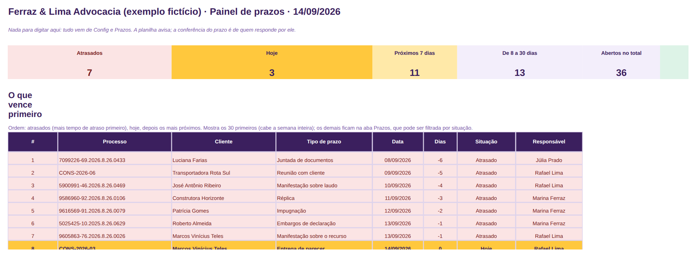

**Detalhe que importa:** o alerta amarelo usa o aviso de Config (7 dias); a janela do painel vai
até 30 dias. Prazo Feito fica cinza e some do painel. A planilha avisa; a contagem e a conferência
na fonte oficial são de quem responde pelo caso.

### 4.2 Andamento por processo (arquivo 02)
**Responde:** em que pé está cada caso, o que vem depois e quais estão parados?
**Você preenche:** fases, áreas e responsáveis em Config; em Processos, uma linha por caso com fase,
próxima ação, data e última atualização. A cada movimentação, atualize os três.
**Sai:** ativos, ação atrasada, ação nesta semana, sem próxima ação, parados, encerrados (no
exemplo: 30, 7, 12, 0, 4 e 8); por fase, por área e por responsável; os casos parados há mais tempo.
**Prompt:** Prazos 05 (resumo de andamento para o sócio), Prazos 07 (pendências viram tarefas).

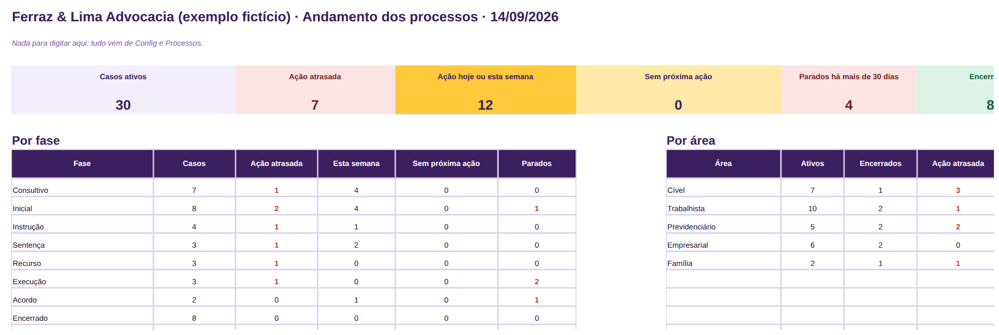

**Detalhe que importa:** "Sem próxima ação" é o quadro mais importante: ninguém sabe o próximo
passo daquele caso. Parado há mais de 30 dias (Config) pode ser só espera do andamento; registre
isso na observação. Fase Encerrado tira o caso dos ativos.

### 4.3 Rotina da semana do escritório (arquivo 03)
**Responde:** a rotina de segunda e de sexta está sendo feita, por quem, e qual parte é pulada?
**Você preenche:** em Config, a segunda-feira da semana 1; em Rotina, as linhas de segunda e sexta
com minutos e responsável e, toda semana, Sim ou Não.
**Sai:** aderência das últimas 4 semanas, série das últimas 8, minutos por semana, a rotina mais
pulada.
**Prompt:** Prazos 02 (rotina de segunda), Prazos 06 (pauta de segunda), Prazos 08 (semana revisada).

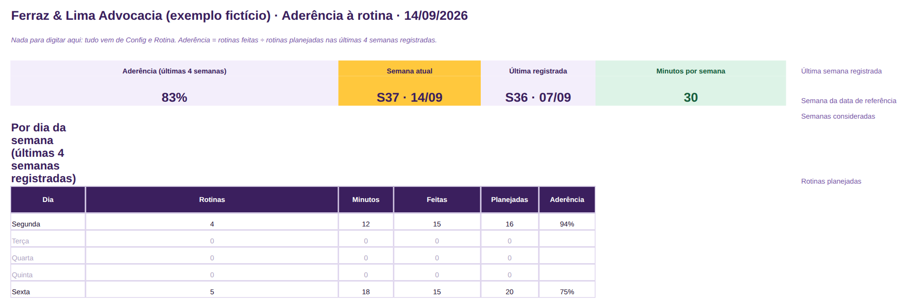

**Detalhe que importa:** o exemplo soma 30 minutos por semana (4 rotinas de segunda, 12 minutos;
5 de sexta, 18) e mostra 83 % de aderência nas últimas 4 semanas. Abaixo de 70 % fica vermelho. A rotina mais pulada merece ser encurtada, delegada ou trocada de dia, não bronca.

### 4.4 Checklist de abertura e encerramento de caso (arquivo 04)
**Responde:** qual caso abriu sem contrato ou procuração, qual encerrou sem cobrar a última parcela?
**Você preenche:** até 10 itens de abertura e 10 de encerramento em Config; em Checklist, uma linha
por caso e, em cada item, Sim, Não ou N/A.
**Sai:** casos com pendência (mais itens primeiro), item mais esquecido, por responsável e a coluna
"O que falta".
**Prompt:** Prazos 07 (pendências viram tarefas), Clientes 08 (encerramento e pedido de avaliação).

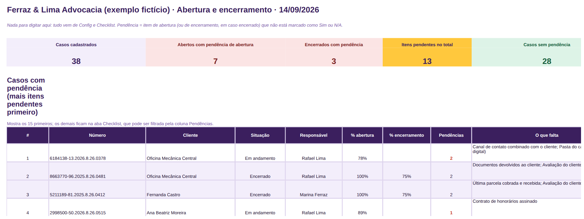

**Detalhe que importa:** vazio conta como pendente, de propósito. Itens de encerramento só contam
quando a situação vira Encerrado. Se o mesmo item pende em vários casos, o problema é a rotina, não o
caso (no exemplo, 13 itens pendentes em 10 casos; o mais esquecido é "Caso cadastrado no caixa e na
carteira").

### 4.5 Custo-hora do escritório (arquivo 05)
**Responde:** quanto custa uma hora do meu escritório e qual é a hora mínima que posso cobrar?
**Você preenche:** Custos fixos (o que paga todo mês), Pessoas (pró-labore ou salário, horas de
trabalho e faturáveis) e, em Config, margem e impostos sobre o que entra.
**Sai:** custo total, custo-hora, hora mínima a cobrar, ocupação, custo por pessoa e a sensibilidade
(e se as horas faturáveis caírem?).
**Prompt:** Honorários 01 (entender o custo-hora), Honorários 03, Caixa 03 (onde cortar custo fixo).

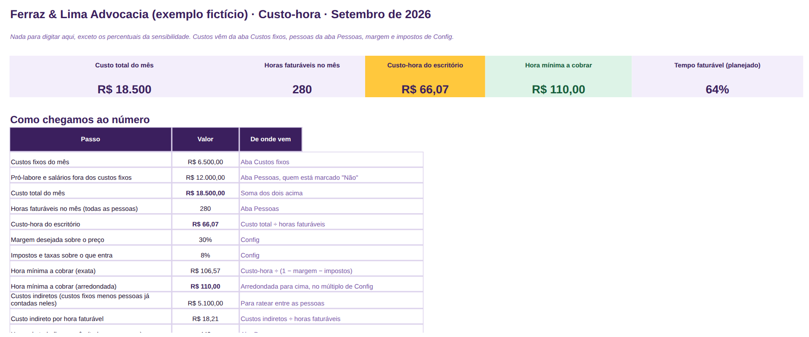

**Detalhe que importa:** hora mínima = custo-hora ÷ (1 − margem − impostos), arredondada para cima em
múltiplos de R$ 5 (no exemplo: R$ 66,07 ÷ (1 − 30 % − 8 %) = R$ 106,57, arredondada para R$ 110).
Se o custo de alguém já está em Custos fixos (a bolsa da estagiária), marque "Sim" em "Já está nos
custos fixos?" para não contar duas vezes. Ocupação abaixo de 50% fica destacada.

### 4.6 Simulador de honorários (arquivo 06)
**Responde:** quanto o caso custa e qual modalidade (fixo, hora, êxito, misto) dá a melhor margem?
**Você preenche:** bloco 1 (cliente, área, custo-hora, valor em discussão, chance de êxito estimada),
2 (horas por etapa), 3 (despesas) e 4 (o que pretende cobrar em cada modalidade).
**Sai:** modalidade recomendada, margem esperada, risco, custo total, hora mínima para o caso e a
comparação das quatro com "se o caso for perdido" e ponto de equilíbrio.
**Prompt:** Honorários 02 (revisar pela margem), Honorários 07 (antes de escolher), Honorários 08.

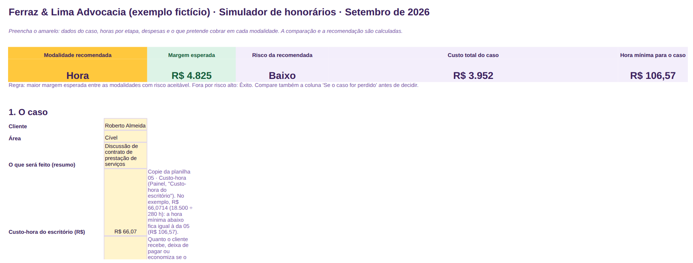

**Detalhe que importa:** a recomendação é a maior margem entre as modalidades de risco aceitável
(no exemplo, o caso do Roberto Almeida: 53 horas, custo do caso R$ 3.952, recomendação "Hora" com
margem esperada R$ 4.825; a proposta saiu como Misto por escolha do escritório). Êxito puro vira risco
alto com chance abaixo de 60 % (Config). A chance de êxito é a sua estimativa de gestão, não uma
avaliação que a planilha faça.

### 4.7 Proposta de honorários (arquivo 07)
**Responde:** como apresentar etapas, valores, entrada, parcelas com datas e validade em uma página?
**Você preenche:** dados do escritório em Config; em Proposta, número, cliente, etapas com valor,
êxito, entrada, parcelas e intervalo; em Registro, cada proposta enviada e a situação.
**Sai:** a proposta pronta para PDF (uma página A4), o cronograma de pagamento e, no Registro,
aguardando, fechadas, perdidas, taxa de fechamento e alerta de validade vencida.
**Prompt:** Honorários 04 (texto de apresentação), Honorários 05 (responder a pedido de desconto).

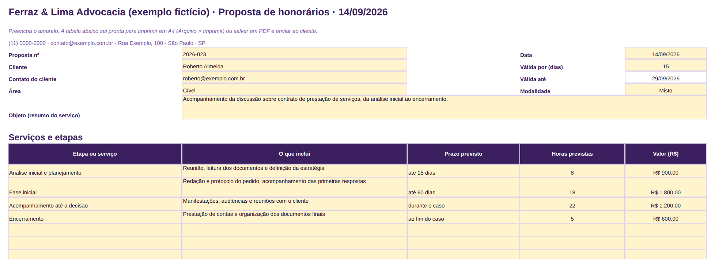

**Detalhe que importa:** os valores vêm do Simulador (06); leva 20 minutos na primeira proposta e 5
nas seguintes. A proposta não substitui o contrato de honorários do escritório. Antes de enviar, o
checklist do arquivo 25: nenhum número interno (custo-hora, margem) vai no arquivo do cliente. Em
Config, tire o "(exemplo fictício)" do nome antes da primeira proposta.

### 4.8 Tabela de referência de honorários (arquivo 08)
**Responde:** qual é a faixa coerente por área e serviço, e quais casos estão abaixo do mínimo?
**Você preenche:** custo-hora (da 05), impostos, margens mínima e alvo e folga em Config; em
Referência, horas típicas por serviço; em Nossos casos, contratado e horas estimadas de cada caso.
**Sai:** hora mínima e hora alvo, faixa em reais por serviço, valor por hora médio por área, casos
abaixo do mínimo e quanto falta.
**Prompt:** Honorários 06 (montar a tabela de referência interna).

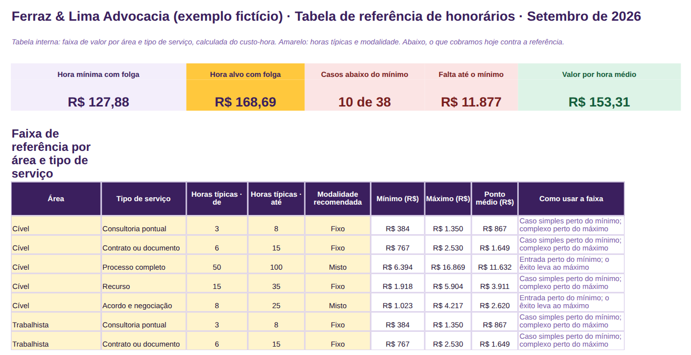

**Detalhe que importa:** a 08 usa a "hora mínima com folga" (custo-hora × 1,20 ÷ (1 − margem −
impostos): R$ 127,88 no exemplo, contra os R$ 110 da 05), porque conta 20 % de horas não previstas;
mínimo = horas "de" × hora mínima com folga; máximo = horas "até" × hora alvo (R$ 168,69, com a margem
alvo de 45 %). Abaixo do mínimo, o caso paga o custo, mas não a margem (10 dos 38 casos do exemplo).
Os valores são do seu escritório, calculados do seu custo; não é tabela oficial de nenhuma entidade.

### 4.9 Caixa do escritório (arquivo 09)
**Responde:** o que entrou, o que saiu, quanto sobrou, o que está a receber e para onde foi o dinheiro?
**Você preenche:** saldo inicial, categorias e clientes em Config; em Lançamentos, uma linha por
movimento com data, tipo, categoria, cliente, caso, valor, forma e Pago?.
**Sai:** entrou, saiu, sobrou, saldo, a receber, a pagar; para onde foi e de onde veio; por cliente; o
ano mês a mês com gráfico.
**Prompt:** Caixa 01 (explicar o mês), Caixa 02 (dois meses), Caixa 03 (cortar), Caixa 08 (achar o erro).

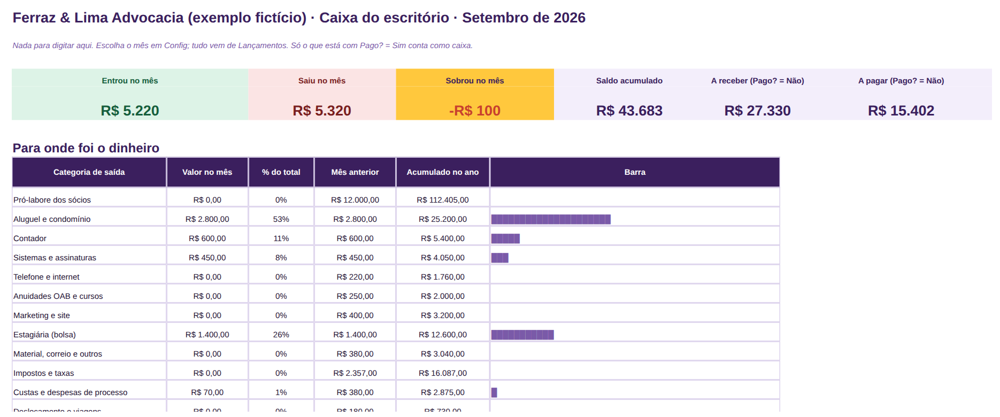

**Detalhe que importa:** só Pago? = Sim conta como caixa; honorário faturado e não recebido entra
com Não e vira Sim quando cair (no exemplo, setembro até 11/09: entrou R$ 5.220, saiu R$ 5.320, saldo
R$ 43.683; agosto fechado: entrou R$ 26.900, saiu R$ 21.897). É a planilha que alimenta a 10, a 11, a
12 e a 18.

### 4.10 Provisão de impostos, 13º e férias (arquivo 10)
**Responde:** quanto deveria estar separado, e o que está guardado cobre o próximo compromisso?
**Você preenche:** alíquota efetiva combinada com o contador, férias, 13º e equipe em Config; em
Entradas e pagamentos, por mês, o que entrou (da 09) e o que foi pago.
**Sai:** a separar no mês, saldo provisionado, compromisso do mês seguinte, quanto falta e a
situação; o ano mês a mês.
**Prompt:** Caixa 04 (preparar a reunião com o contador), Caixa 05 (perguntas sobre provisão).

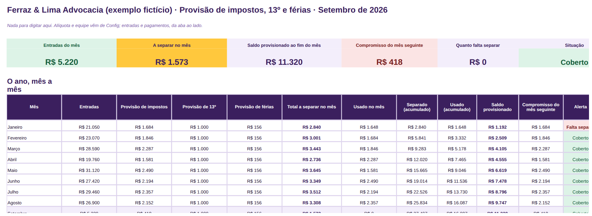

**Detalhe que importa:** provisão = entradas × alíquota efetiva (8 % no exemplo, a mesma da 05, 06,
08 e 18; saldo provisionado ao fim de setembro R$ 11.320). A planilha separa dinheiro; não apura
imposto e não afirma qual é a sua alíquota: isso vem do contador (bônus 24). Compare o saldo
provisionado com o extrato da conta separada todo dia 5.

### 4.11 Pró-labore e separação pessoa física × escritório (arquivo 11)
**Responde:** cada sócio retirou o combinado ou mais, e quanto de lucro do trimestre cabe distribuir?
**Você preenche:** sócios, pró-labore fixo e regra de distribuição em Config; Resultado mensal (da
09); Retiradas, uma linha por movimento escritório × sócio.
**Sai:** combinado × retirado no mês e no ano, fora do combinado, a acertar, lucro e distribuição por
trimestre.
**Prompt:** Caixa 06 (separar o que é do escritório e o que é pessoal), Painel 01 (explicar o mês).

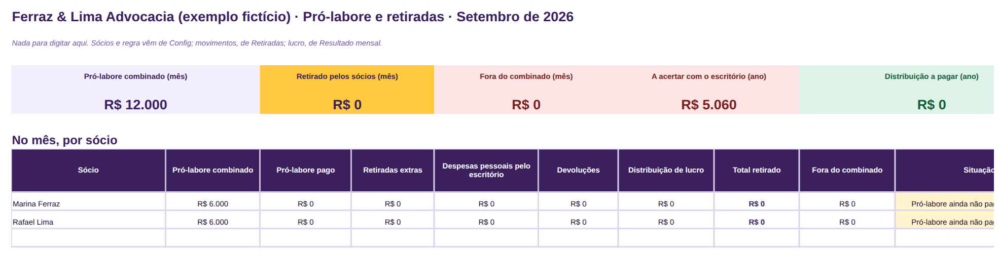

**Detalhe que importa:** fora do combinado = retiradas extras + despesas pessoais pagas pelo
escritório − devoluções (no exemplo, R$ 5.060 a acertar no ano); a distribuição segue a regra e só
sai de trimestre fechado (1º e 2º trimestres pagos em abril e julho). O formato tributário de cada
retirada se combina com o contador.

### 4.12 Reserva de três meses e metas de caixa (arquivo 12)
**Responde:** quantos meses de custo fixo a reserva cobre, quando chego à meta e como vão as metas?
**Você preenche:** tudo em Config: meta em meses (3 é um bom começo), custo fixo dos últimos 3 meses
(da 09), saldo, compromissos, o que já está guardado, aporte mensal e as três metas do trimestre.
**Sai:** meta, reserva hoje, falta guardar, meses cobertos, mês previsto para bater a meta, projeção
de 24 meses com gráfico, metas com barra de progresso.
**Prompt:** Caixa 07 (plano para a reserva de três meses).

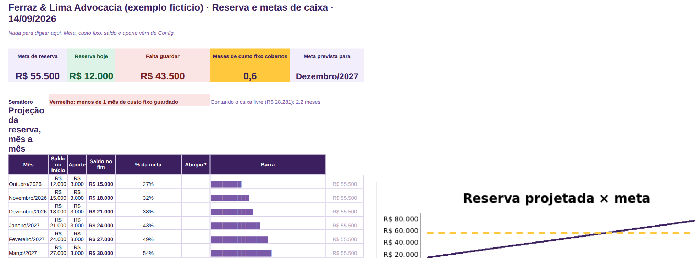

**Detalhe que importa:** a projeção supõe aporte igual todo mês, sem rendimento (no exemplo: meta
R$ 55.500, reserva R$ 12.000, aporte de R$ 3.000 chega em dezembro de 2027). Quando a reserva
bater a meta, a decisão (manter, reduzir, distribuir) é dos sócios. Prazo vencido em uma meta é sinal
para renegociar meta ou aporte, não fracasso.

### 4.13 Carteira de clientes e casos (arquivo 13)
**Responde:** quanto está contratado, quanto entrou e quanto ainda vai entrar, por área e por cliente?
**Você preenche:** listas em Config; Clientes (tipo PF/PJ, área); Casos, uma linha por caso com
número ou referência, fase, modalidade, contratado, recebido e abertura.
**Sai:** contratado, recebido, a receber, % recebido, ativos e encerrados; por área, responsável e
modalidade; top 5 clientes.
**Prompt:** Clientes 01 (resumir a carteira para o sócio), Clientes 07 (confirmação de contratação).

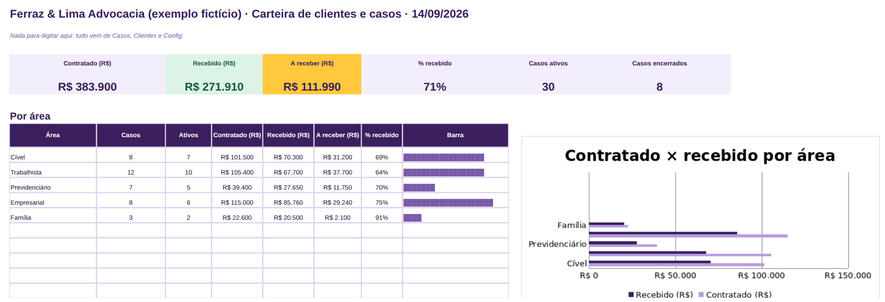

**Detalhe que importa:** o cliente vem antes do caso (Clientes alimenta a lista de Casos). A 13 é a
fonte do cadastro de casos: a lista daqui é copiada para a aba Casos das 01, 02, 04, 08, 14 e 16;
mantenha o número escrito igual em todas. No exemplo: R$ 383.900 contratados, R$ 271.910 recebidos,
R$ 111.990 a receber, 30 casos ativos.

### 4.14 Parcelas e inadimplência (arquivo 14)
**Responde:** o que vence, o que já venceu, qual é a inadimplência e quem cobrar primeiro, com qual mensagem?
**Você preenche:** janelas e régua de cobrança em Config; Casos (copiados da 13); Parcelas, uma
linha por parcela com vencimento e valor; ao receber, Sim e a data.
**Sai:** em aberto, vencido, inadimplência, vencidas por faixa, "Cobrar primeiro" com a ação da régua
para cada parcela, e as que vencem em 7 e 30 dias.
**Prompt:** Clientes 02 (quem cobrar primeiro), Clientes 03 (cobrança educada), Clientes 04, Clientes 05.

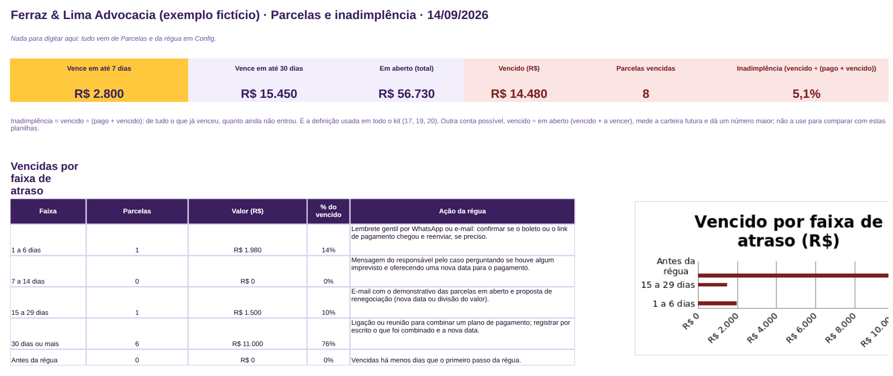

**Detalhe que importa:** inadimplência = vencido ÷ (pago + vencido), a mesma conta em todo o kit
(no exemplo: R$ 14.480 ÷ (R$ 271.910 + R$ 14.480) = 5,1 %). A régua do exemplo tem quatro degraus
(1 dia: lembrete gentil; 7: mensagem do responsável; 15: e-mail com demonstrativo e renegociação;
30: ligação ou reunião e plano por escrito), sem ameaça; as mensagens estão no bônus 22. "Cobrar
primeiro" ordena por valor × dias de atraso. A conversa com o cliente é sua.

### 4.15 Funil de propostas (arquivo 15)
**Responde:** quanto tenho em aberto, quanto devo fechar, o que está parado e por que perco?
**Você preenche:** meta do trimestre, limite de "parada" e probabilidades em Config; Propostas, uma
linha por proposta com valor, etapa e datas; ao fechar, Fechada ou Perdida com motivo.
**Sai:** em aberto, previsão ponderada, fechado × meta, taxa de fechamento, funil, "O que mexer
primeiro", por área e origem, motivos de perda.
**Prompt:** Clientes 06 (por que as propostas não fecham), Honorários 05 (pedido de desconto).

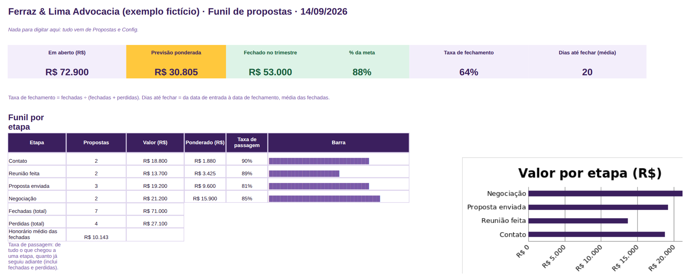

**Detalhe que importa:** previsão ponderada = valor × probabilidade da etapa (contato 10 %, reunião
25 %, proposta enviada 50 %, negociação 75 %; no exemplo, 9 abertas somando R$ 72.900, previsão
R$ 30.805). O motivo da perda é a parte mais valiosa da planilha. Proposta fechada vira caso na 13 e
parcelas na 14.

### 4.16 Horas por caso e por pessoa (arquivo 16)
**Responde:** qual caso consome mais do que paga, qual vai estourar as horas e como está a ocupação?
**Você preenche:** pessoas, custos fixos (da 05) e atividades em Config; Casos (da 13) com horas
estimadas; Lançamentos, uma linha por pessoa, dia e caso.
**Sai:** horas, faturáveis, custo das horas, ocupação, "Casos para olhar primeiro", por pessoa e o
semáforo de todos os casos.
**Prompt:** Honorários 03 (casos que consomem mais do que pagam), Prazos 04 (distribuir a semana).

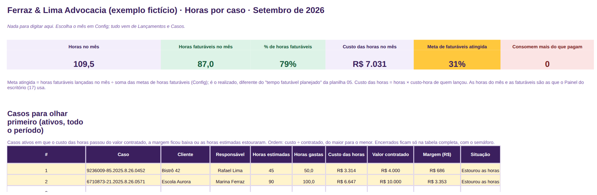

**Detalhe que importa:** custo-hora da pessoa = custo mensal ÷ horas faturáveis + rateio do custo
fixo (R$ 72,76 por sócio no exemplo). "Consome mais do que paga" = custo das horas maior que o
contratado; "Perto do limite" = mais de 85 % das horas estimadas. Dois minutos no fim do dia; horas
lançadas de memória saem erradas.

### 4.17 Painel do escritório (arquivo 17)
**Responde:** como está o escritório nesta sexta, em uma tela, contra os limites e o mês anterior?
**Você preenche:** toda sexta, na aba Dados, os totais das 01, 16, 09, 13, 14 e 15 (a coluna "Copie
de" diz de onde); uma vez, limite e sentido; no fim do mês, a linha em Histórico.
**Sai:** prazos, horas, caixa, recebíveis, propostas e casos ativos, cada um com semáforo e
comparação com o mês anterior; gráficos do Histórico.
**Prompt:** Painel 01 (explicar o mês ao sócio), Painel 07 (contratar, associar ou não).

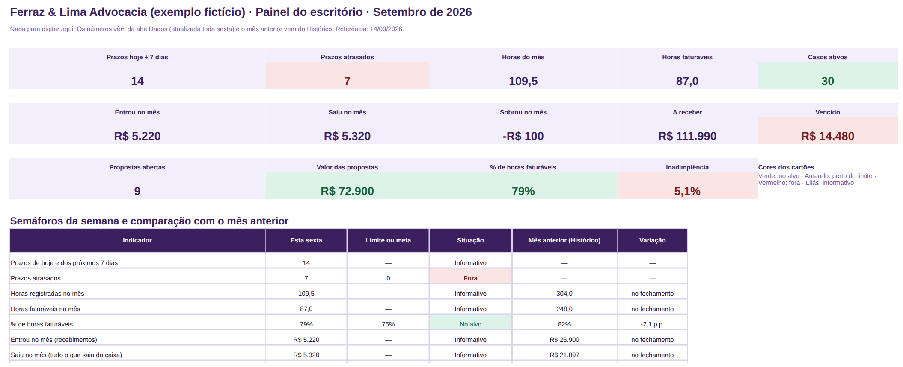

**Detalhe que importa:** é a planilha mais simples do kit de propósito: 14 números copiados à mão em
10 minutos, dos painéis das 01, 16, 09, 13, 14 e 15 (no exemplo, os da sexta 11/09: 14 prazos, 109,5 h,
R$ 5.220 entrados, R$ 14.480 vencidos, 9 propostas). Linha sem limite fica "Informativo". Fora do
alvo primeiro: atrasados e vencido pedem ação na segunda (01 e 14).

### 4.18 Resultado mensal simplificado (arquivo 18)
**Responde:** o escritório deu lucro de verdade neste mês, com qual margem, contra o anterior e o previsto?
**Você preenche:** mês e % de impostos em Config; Resultado, por mês, a receita por modalidade e cada
linha de custo (totais da 09); Previsto, o que espera por mês.
**Sai:** receita, saídas, resultado e margem; comparação com o mês anterior e o previsto; receita por
modalidade; o ano com gráfico.
**Prompt:** Caixa 02 (comparar dois meses), Painel 02 (relatório mensal para os sócios).

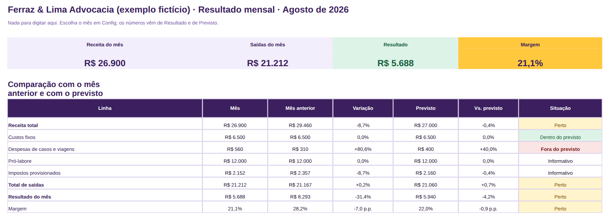

**Detalhe que importa:** DRE simplificada por regime de caixa: entra o recebido, sai o pago, e os
impostos entram como % da receita (8 %) para o resultado não parecer maior do que é. No exemplo,
agosto: receita R$ 26.900, saídas R$ 21.212, resultado R$ 5.688, margem 21,1 %. Retiradas extras e
distribuição de lucro ficam na 11, não aqui. Meses futuros ficam em branco.

### 4.19 Metas do trimestre do escritório (arquivo 19)
**Responde:** estamos no ritmo para bater as metas do trimestre?
**Você preenche:** trimestre em Config; em Metas, até 3 objetivos com até 3 resultados-chave (ponto
de partida, meta, valor atual, dono, sentido); toda sexta, o valor atual e a coluna em Semanas.
**Sai:** atingidos, em risco, progresso médio; painel por objetivo; a lista completa com semáforo;
histórico de 13 semanas.
**Prompt:** Painel 05 (meta realista), Painel 06 (meta × realizado: explicar o desvio).

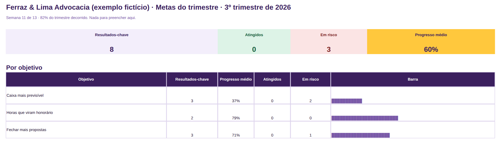

**Detalhe que importa:** o semáforo compara o progresso com o tempo decorrido: 100% é "Atingido";
até 10 pontos abaixo, "No ritmo"; até 25, "Atenção"; além, "Em risco". Onde menor é melhor, a conta
inverte sozinha. Meta em risco pede olhar a rotina (03) antes de mexer na meta.

### 4.20 Resumo do mês para a IA e para o contador (arquivo 20)
**Responde:** como foi o mês, indicador por indicador, em texto pronto para o sócio, o contador e a IA?
**Você preenche:** mês em Config; em Indicadores, até 12 indicadores com meta, sentido, mês anterior
e mês atual (das 17 e 18); em Resumo, só a célula de observações.
**Sai:** o Painel com variação, meta e situação; a aba Resumo com as frases do mês, os destaques
automáticos e o **bloco único para copiar**.
**Prompt:** Painel 01 (explicar o mês), Painel 02, Painel 03 (8 slides), Painel 04, Caixa 04 (contador).

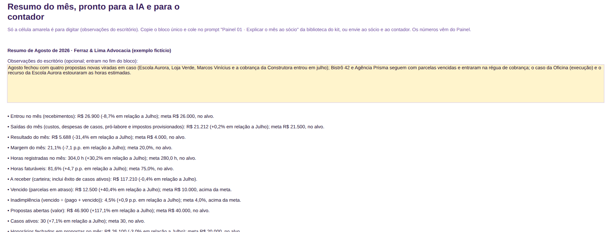

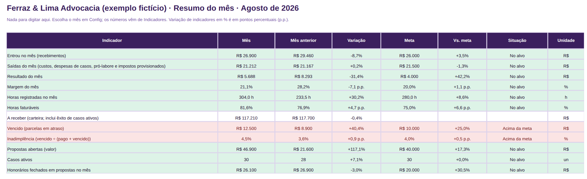

**Detalhe que importa:** o bloco só tem totais do escritório, sem cliente nem processo: é o único
texto do kit pronto para colar na IA sem tratamento. Em %, digite 21,1 e não 0,211. Todo mês, mova
"Mês atual" para "Mês anterior" (o exemplo compara agosto com julho). A observação do escritório é o
porquê dos números.

## 5. Usar a IA com segurança (leia antes do primeiro prompt)

Os 40 prompts da biblioteca funcionam no ChatGPT, no Copilot, no Gemini e no Claude, inclusive nas
versões gratuitas. Cinco regras, na ordem em que importam:

1. **Nunca cole nome de cliente ou número de processo real em uma IA pública.** Nem CPF, CNPJ,
   telefone, endereço, valor de causa identificável ou trecho de peça, contrato, documento ou
   conversa com o cliente. O sigilo profissional é seu; a IA pública não tem dever de sigilo e pode
   guardar o que recebe. Antes de colar, troque por "Cliente A", "Cliente B", "Processo 1",
   "Processo 2". Na prática: copie o bloco da planilha para um texto, troque a coluna Cliente por
   letras na ordem em que aparecem, apague a coluna do número do processo e leia uma vez procurando
   nome próprio. Se o contexto ainda identifica alguém ("o único restaurante que atendemos"), troque
   o contexto também. É a regra do guia LGPD (bônus 23, seção 6), e vale escrevê-la no termo de
   confidencialidade da equipe.
2. **Nenhum prompt do kit produz petição, tese, parecer, cálculo de prazo processual ou orientação
   jurídica.** São prompts de gestão: explicar o mês, escrever uma cobrança educada, preparar a
   reunião com o contador, revisar uma proposta pela margem, montar a rotina.
3. **A IA erra com confiança.** Todo número, data e conclusão que ela escreve passa por você antes
   de virar e-mail, proposta ou decisão. Cada prompt diz o que conferir. Se a IA afirmar um dado que
   não estava no bloco colado, apague.
4. **Contexto é o segredo.** Os prompts começam com quem lê, para quê e o que você já tem. Se a
   resposta vier ruim, não reescreva o prompt: responda "Refaça: [o que faltou]".
5. **O bloco da planilha 20 é o único pronto para colar.** As tabelas dos outros painéis trazem
   coluna de cliente e de processo: passe pela regra 1 antes. A tabela "De onde vem cada bloco", na
   abertura da biblioteca, diz qual aba copiar para cada prompt.

Guarde os prompts que funcionaram, com as suas adaptações. O modelo em branco no fim da biblioteca
serve para criar os seus.

## 6. A rotina

Depois das quatro semanas, é isto: trinta minutos por semana, um fechamento por mês, meia tarde por
trimestre.

**Segunda, 12 minutos (prazos).** Agenda (01): resolver ou reagendar os atrasados, confirmar com cada
responsável os prazos dos próximos 7 dias, registrar os novos. Andamento (02): parados e sem próxima
ação. Parcelas (14): marcar as pagas e enviar as mensagens de "Cobrar primeiro" (bônus 22). Rotina
(03): marcar Sim. Prompts: Prazos 01 na semana cheia; Clientes 03 para a cobrança fora do modelo.

**Sexta, 18 minutos (caixa e painel).** Caixa (09): lançar a semana, marcar Sim no que caiu. Horas
(16): conferir se todos lançaram. Carteira (13): recebidos e fases. Funil (15) e Registro da
Proposta (07): etapas e datas. Painel do escritório (17): copiar os 14 totais para Dados. Metas (19)
e Reserva (12): valor atual. Rotina (03): marcar Sim. Prompt: Prazos 08 para fechar a semana em
texto.

**Dia 5, 1 hora e meia (fechamento do mês).** Na ordem: Caixa (09) conciliado com o extrato;
Provisão (10) com as entradas e a transferência para a conta separada; Pró-labore (11) com retiradas
e despesas pessoais; Reserva (12) com o aporte; Resultado mensal (18); Painel (17) com a linha do
mês em Histórico; Resumo do mês (20) com os 12 indicadores e a observação. Checklist "Fechamento do
mês" (25). Depois, o bloco único da 20 nos prompts Painel 01 (sócio) e Caixa 04 (contador), a
reunião de 30 minutos do bônus 24 e, se houver reunião de sócios, o modelo 27 com o Painel 03.

**Fim do trimestre, meia tarde.** Metas (19): fechar e definir as próximas com o Painel 05.
Pró-labore (11): distribuição do lucro pela regra. Custo-hora (05) e Tabela de referência (08):
revisar com as horas reais da 16. Funil (15): motivos de perda com o Clientes 06. Prazos 03 para o
padrão dos atrasados; Painel 04 para as perguntas difíceis; Painel 07 se a conversa for contratar
ou associar. Modelo 29 (carteira para o contador) na reunião anual maior.

**Quando abre um caso, 5 minutos.** Checklist de abertura (25 e 04); linha na Carteira (13),
Parcelas (14), Horas (16), Agenda (01) e Andamento (02). Mensagem 01 ou 02 do bônus 22.

**Antes de cada proposta, 20 minutos na primeira vez e 5 nas seguintes.** Tabela de referência
(08) para a faixa; Simulador (06) para a modalidade; Proposta (07) para o documento; Honorários 02
para revisar pela margem; checklist "Antes de enviar a proposta" (25); linha no Funil (15). Modelo 28
quando a proposta pede apresentação.

## 7. Erros comuns e como resolver

| Sintoma | Causa provável | O que fazer |
|---|---|---|
| Painel zerado | Mês ou ano em Config diferente dos lançamentos | Confira Config; os lançamentos precisam ter data no mês e no ano do painel |
| "#NOME?" em uma coluna | Arquivo aberto em um programa antigo (Excel anterior a 2007) ou em um aplicativo que não tem alguma função | Abra no Excel 2016 ou mais novo, no Microsoft 365 ou no Google Sheets |
| Lista suspensa não abre | Validação perdida ao colar de outra planilha, ou lista de Config com linha vazia no meio | Cole só valores (Colar especial > Valores); em Config, preencha de cima para baixo sem pular linha |
| Prazo não aparece no painel | Marcado como Feito, ou fora da janela de 30 dias de Config | Confira a coluna Feito? e a janela do painel |
| Caso não aparece em Parcelas ou Horas | Número do processo escrito diferente do que está na Carteira (13) | Copie a lista de casos da 13 de novo; o texto precisa ser idêntico |
| Cliente não aparece na lista de Casos | Cliente ainda não cadastrado na aba Clientes | Cadastre o cliente antes do caso |
| Custo-hora alto demais | Bolsa ou salário contado duas vezes (Custos fixos e Pessoas) | Marque "Sim" em "Já está nos custos fixos?" na aba Pessoas |
| Hora mínima em branco | Margem + impostos somam 100% ou mais em Config | Revise os percentuais; a soma precisa ficar abaixo de 100% |
| Caixa não bate com o extrato | Lançamento com Pago? = Não, ou movimento pessoal do sócio lançado como despesa | Confira A receber e A pagar; movimentos dos sócios vão para a planilha 11 |
| Provisão zerada | Alíquota em branco em Config, ou entradas não lançadas | Peça a alíquota efetiva ao contador e lance as entradas do mês |
| Percentual estranho no Resumo do mês | Digitou 0,211 em vez de 21,1 | Em Indicadores, percentuais são digitados como 21,1 |
| Progresso maior que 100% nas Metas | Meta igual ao ponto de partida | Meta e ponto de partida precisam ser diferentes |
| Data virou número | Célula formatada como número | Selecione a coluna e mude o formato para data |
| Fórmula sumiu | Você digitou por cima de uma célula branca | Desfaça (Ctrl+Z) ou baixe o arquivo original de novo |
| Gráfico não atualiza no Sheets | Intervalo do gráfico não pegou as linhas novas | Clique no gráfico > editar > amplie o intervalo |
| Datas do exemplo mudaram sozinhas | É de propósito: os prazos do exemplo são relativos a hoje | Apague o exemplo e digite os seus |

## 8. Suporte e reembolso

Suporte por e-mail, para acesso, arquivos e dúvidas deste manual:
**suporte@seusociogestor.com.br**, resposta em até 5 dias úteis. Sem telefone, sem WhatsApp. Não é
consultoria: não preenchemos os seus dados, não analisamos o seu escritório e não respondemos dúvida
jurídica, tributária ou contábil. Alíquota, regime e obrigações são assunto do seu contador.

Direito de arrependimento de 7 dias, pela página do pedido ou pelo mesmo e-mail, sem explicar. O
valor volta pelo mesmo meio.

ZTRAINING SERVICE LTDA · CNPJ 68.796.613/0001-10 · seusociogestor.com.br
