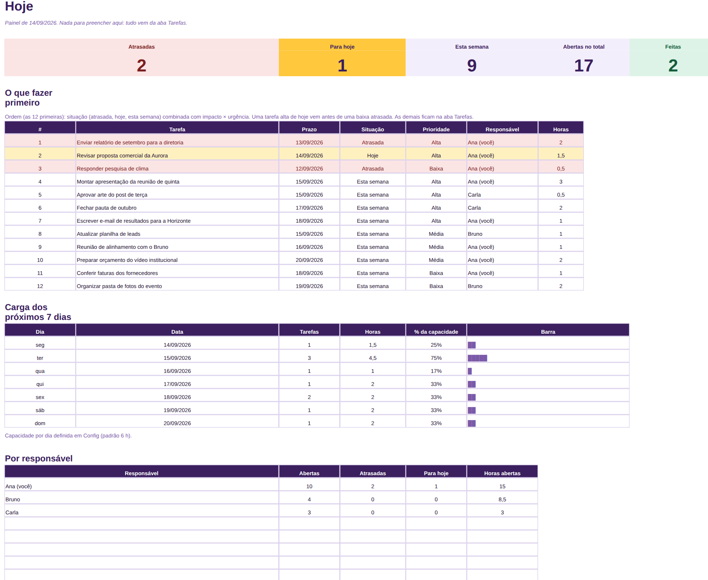
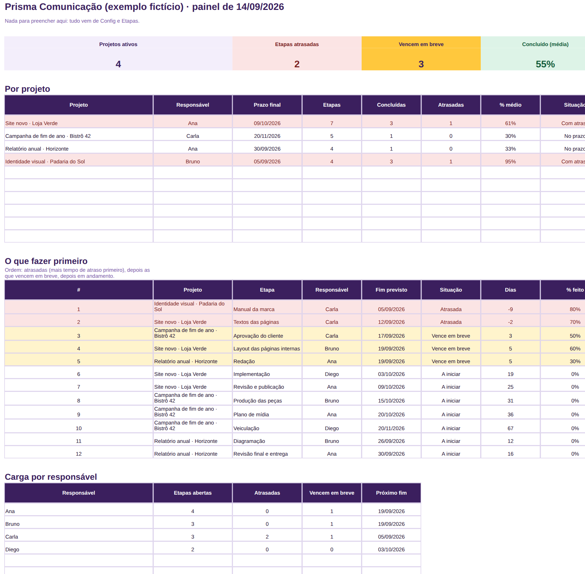
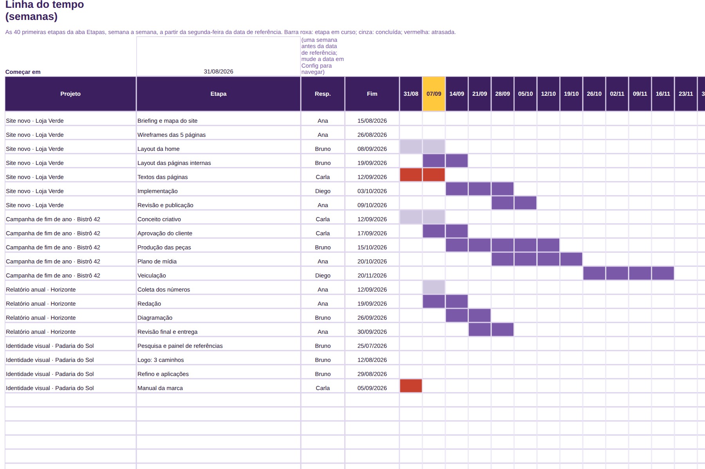
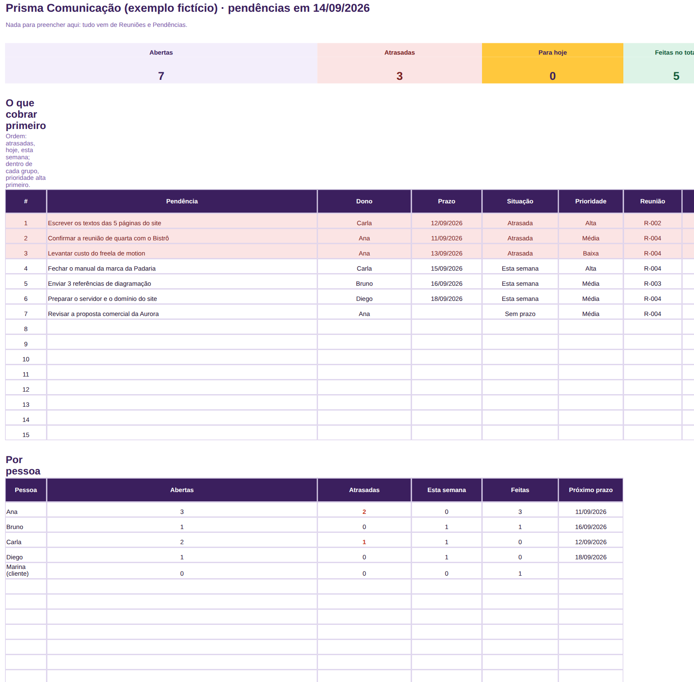
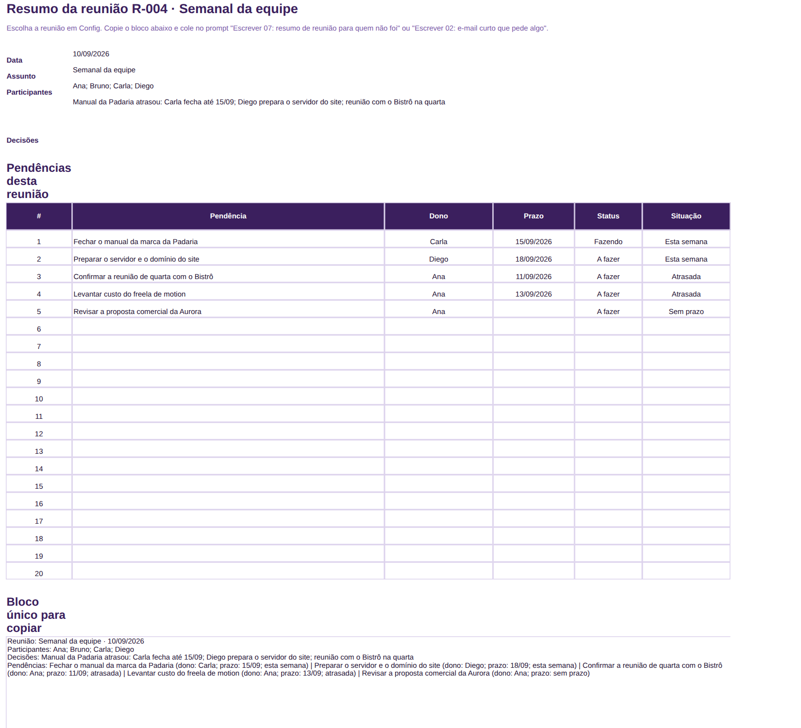
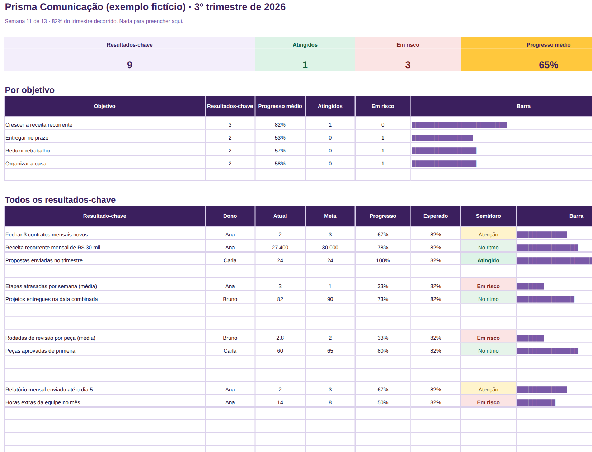
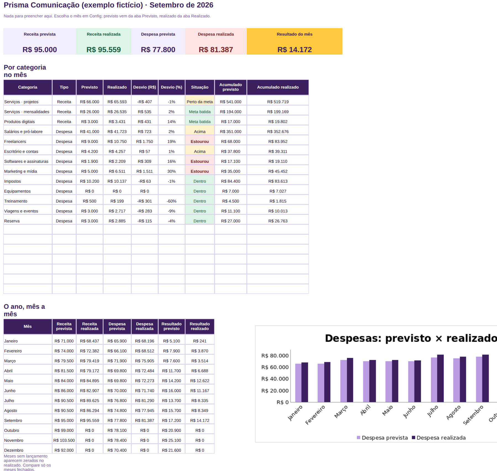
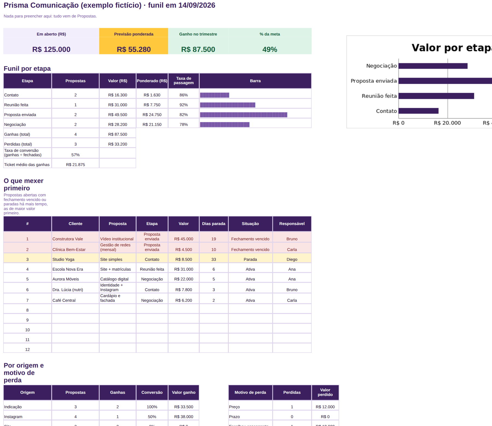
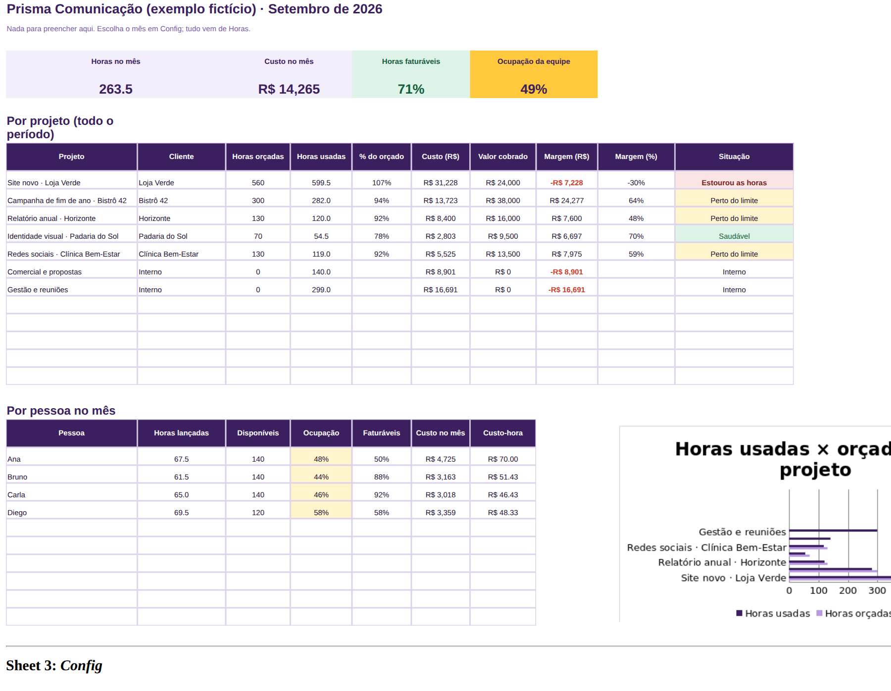
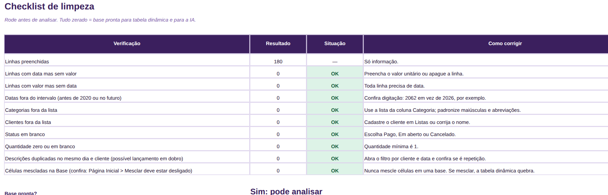

# Manual do método · Kit IA no Trabalho · Completo

Versão 1.0 · setembro de 2026 · Seu Sócio Gestor

Este manual é para ser lido uma vez, em 15 minutos, e consultado depois. Ele explica o método em
quatro passos, mostra o que cada uma das 10 planilhas faz e em que ordem usar, ensina a usar a IA
com segurança e fecha com a rotina da semana, do mês e do trimestre. As 8 aulas em vídeo mostram
tudo isso na tela; o manual é o mapa.

## 1. O que você recebeu

| Arquivo | O que é |
|---|---|
| 01 a 03 | As três planilhas do Essencial: Semana Organizada, Relatório Mensal Pronto, Ganhos e Gastos |
| 04 a 10 | As sete planilhas novas: Projetos e Prazos, Ata e Pendências, Metas do Trimestre, Orçamento Previsto × Realizado, Funil de Propostas, Horas e Custo por Projeto, Base Limpa |
| Biblioteca A | 40 prompts do dia a dia (organizar, analisar, escrever, apresentar, revisar, aprender), PDF e txt |
| Biblioteca B | 40 prompts para estruturar e produzir, PDF e txt |
| Dicionário | 60 fórmulas explicadas em uma frase, com exemplo |
| Aulas 1 a 8 | Vídeos de 2 a 3 minutos, tela real, narração e legenda |
| Modelos | 3 apresentações: relatório mensal (8 slides), resultado do trimestre (12), proposta comercial (10) |
| Checklists | Planilha, relatório, apresentação e envio |

Abre tudo no Excel 2019 ou mais novo, no Microsoft 365 e no Google Sheets. As planilhas 04, 05 e 10
usam MÍNIMOSES, MÁXIMOSES e UNIRTEXTO, funções que o Excel 2016 não tem (nelas, o Excel antigo mostra
"#NOME?"). No celular, os aplicativos do Excel e do
Sheets abrem e mostram; para preencher, use o computador. Sem macros, sem instalação, sem login.

## 2. O método em quatro passos

O Essencial tem três passos: preencher, perguntar, entregar. O Completo acrescenta o primeiro, que
é onde a maioria trava: **estruturar**. Quem abre o Excel antes de saber o que a planilha precisa
responder passa a tarde arrumando coluna.

### Estruturar
Antes de abrir qualquer arquivo, responda em uma frase: *quem lê, com que frequência, para decidir
o quê*. O prompt **Estruturar 01** faz isso em cinco minutos e devolve a lista de dados que você
precisa. Se a resposta cabe em uma das 10 planilhas do kit, use a planilha. Se não cabe, a aula 1
e a planilha **Base Limpa** mostram como montar a sua.

### Preencher
Toda planilha do kit tem a mesma anatomia: aba **Config** (nomes, datas, listas), uma ou mais abas
de **lançamento** (as células amarelas), um **Painel** (nada para preencher) e a aba **Como usar**.
Você só digita no amarelo. As listas evitam erro de digitação; as fórmulas ficam protegidas sem
senha.

### Perguntar
Cada painel tem um bloco pronto para copiar (ou uma tabela que você seleciona e copia). Esse bloco
entra no prompt certo da biblioteca, no campo indicado. A IA devolve texto, análise ou roteiro. A
regra de ouro: **a planilha entrega os números; a IA entrega as palavras.** Nunca o contrário.

### Entregar
Antes de enviar, o checklist. Dois minutos que evitam o e-mail de correção. Os modelos de
apresentação recebem os números do Relatório Mensal ou das Metas e o texto que a IA escreveu.

## 3. As 10 planilhas, uma a uma

Para cada planilha: o que ela responde, o que você preenche, o que sai, e o prompt que combina.
Cada uma tem a aba "Como usar" com o passo a passo de 15 minutos.

### 3.1 Semana Organizada (arquivo 01)
**Responde:** o que eu faço primeiro hoje, e a semana cabe nos meus dias?
**Você preenche:** tarefas com prazo, impacto (1 a 3), urgência (1 a 3), horas e responsável.
**Sai:** a aba Hoje com atrasadas, para hoje, esta semana, a lista ordenada e a carga dos próximos
7 dias.
**Prompt:** Organizar 01 (lista bagunçada vira tarefas), Organizar 03 (prioridade).

### 3.2 Relatório Mensal Pronto (arquivo 02)
**Responde:** como foi o mês, indicador por indicador, contra o mês anterior e contra a meta?
**Você preenche:** até 12 indicadores, um número por mês, com meta e sentido (maior ou menor é
melhor).
**Sai:** o painel com variação e situação, o gráfico do indicador escolhido e a aba Resumo, que
escreve as frases e o bloco único para a IA.
**Prompt:** Escrever 01 (relatório executivo), Produzir 14 (versão longa), Apresentar 01 (8 slides).

### 3.3 Ganhos e Gastos (arquivo 03)
**Responde:** quanto sobrou, para onde foi e quantos meses de reserva eu tenho?
**Você preenche:** entradas e saídas, uma por linha, com categoria e se foi pago.
**Sai:** entrou, saiu, sobrou, saldo, a pagar, reserva, categorias com barra e o ano mês a mês.
**Prompt:** Analisar 03 (onde cortar), Escrever 05 (explicar o mês financeiro).

### 3.4 Projetos e Prazos (arquivo 04)
**Responde:** o que está atrasado, o que vence em breve, quem está sobrecarregado?
**Você preenche:** em Config, até 10 projetos e as pessoas; em Etapas, uma linha por etapa com
início, fim previsto e % concluído.
**Sai:** o painel por projeto (etapas, concluídas, atrasadas, % médio, situação), a lista "o que
fazer primeiro", a carga por responsável e a **Linha do tempo** por semanas.
**Prompt:** Organizar 03 (prioridade), Escrever 04 (justificativa para o cliente), Produzir 24
(plano de ação).

**Detalhe que importa:** "Vence em breve" usa o prazo de aviso de Config (7 dias por padrão).
Uma etapa fica "Concluída" quando o % chega a 100 ou quando você preenche o fim real.

### 3.5 Ata e Pendências (arquivo 05)
**Responde:** o que ficou decidido, quem ficou de fazer o quê, e o que está atrasado?
**Você preenche:** em Reuniões, uma linha por reunião com as decisões em frases curtas; em
Pendências, uma linha por tarefa que saiu da reunião, com dono, prazo e status.
**Sai:** Em aberto (o que cobrar primeiro e a carga por pessoa) e **Resumo**, que monta o bloco da
reunião escolhida: data, participantes, decisões e pendências, pronto para a IA.
**Prompt:** Escrever 07 (resumo para quem não foi), Escrever 10 (cobrança educada), Escrever 02
(e-mail curto que pede algo).

### 3.6 Metas do Trimestre (arquivo 06)
**Responde:** estamos no ritmo para bater as metas do trimestre?
**Você preenche:** até 5 objetivos com até 4 resultados-chave cada: ponto de partida, meta e valor
atual. Toda semana, o valor atual.
**Sai:** progresso de cada resultado, comparado com o tempo já decorrido, e o semáforo: atingido,
no ritmo, atenção, em risco. Painel por objetivo e a aba Semanas com o histórico.
**Prompt:** Produzir 25 (indicadores para um objetivo), Analisar 04 (meta realista), Produzir 17
(explicar resultado ruim).

**Como o semáforo decide:** progresso maior ou igual a 100% é "Atingido"; até 10 pontos abaixo do
tempo decorrido é "No ritmo"; até 25 pontos abaixo é "Atenção"; além disso, "Em risco". Para
indicadores em que menor é melhor (horas extras, atrasos), a conta inverte sozinha.

### 3.7 Orçamento Previsto × Realizado (arquivo 07)
**Responde:** o que estourou, o que ficou abaixo, e o ano vai fechar como planejado?
**Você preenche:** em Previsto, o valor planejado por categoria e mês; em Realizado, os
lançamentos (ou o total do mês por categoria).
**Sai:** por categoria no mês (desvio em R$ e %, situação), acumulado do ano e o ano mês a mês
com gráfico previsto × realizado.
**Prompt:** Produzir 26 (orçamento a partir do histórico), Analisar 03 (onde cortar), Produzir 16
(comparar previsto e realizado).

**Detalhe que importa:** o alerta de estouro (10% por padrão) vale para despesas. Para receitas,
o mesmo limite marca "Abaixo da meta".

### 3.8 Funil de Propostas (arquivo 08)
**Responde:** quanto tenho em aberto, quanto devo fechar, o que está parado, e por que perco?
**Você preenche:** uma linha por proposta com valor, etapa, datas e, ao fechar, ganha ou perdida e
o motivo. As probabilidades por etapa ficam em Config.
**Sai:** previsão ponderada, funil por etapa com taxa de passagem, "o que mexer primeiro" (vencidas
e paradas, maior valor primeiro), conversão por origem e motivos de perda.
**Prompt:** Escrever 02 (retomar proposta parada), Produzir 23 (proposta a partir do briefing),
Analisar 01 (o que os números dizem).

### 3.9 Horas e Custo por Projeto (arquivo 09)
**Responde:** quanto custa cada projeto de verdade, sobrou margem, e quem está com a agenda cheia?
**Você preenche:** em Config, as pessoas com custo mensal e horas disponíveis (o custo-hora é
calculado) e os projetos com horas orçadas e valor cobrado; em Horas, cada pessoa lança por dia.
**Sai:** por projeto (horas usadas × orçadas, custo, margem, situação) e por pessoa no mês
(ocupação e horas faturáveis).
**Prompt:** Produzir 27 (precificar), Analisar 06 (perguntas antes de decidir), Escrever 04
(justificar horas a um cliente).

**Detalhe que importa:** projetos internos (comercial, gestão) entram com status "Interno" para
aparecerem no custo sem falsear a margem.

### 3.10 Base Limpa (arquivo 10)
**Responde:** meus dados estão em condições de virar tabela dinâmica, gráfico ou análise de IA?
**Você preenche:** a aba Base com os seus registros (uma linha por registro) e as Listas.
**Sai:** o Checklist de limpeza (linhas sem valor, datas erradas, categorias fora da lista,
duplicadas) e o Resumo por categoria e mês feito só com SOMASES.
**Prompt:** Estruturar 03 (desenhar as colunas), Produzir 07 (limpar dados), Produzir 06 (tabela
dinâmica).

Esta é a planilha que ensina a fazer as outras. As sete regras estão na aba Como usar; a aula 2
monta uma tabela dinâmica em cima dela em dez minutos.

## 4. Em que ordem usar

Não abra as dez de uma vez. A ordem que funciona:

| Semana | Planilha | Por quê |
|---|---|---|
| 1 | Semana Organizada + Ata e Pendências | Organizam o dia e a reunião; efeito imediato |
| 2 | Relatório Mensal Pronto + Metas do Trimestre | Definem o que você mede |
| 3 | Ganhos e Gastos ou Orçamento | Dinheiro: pessoa ou negócio pequeno usa Ganhos e Gastos; equipe com plano anual usa Orçamento |
| 4 | Projetos e Prazos + Horas e Custo | Só se você entrega projeto para cliente ou área |
| 5 | Funil de Propostas | Só se você vende |
| Sempre | Base Limpa | Quando precisar de uma planilha que não existe no kit |

## 5. Usar a IA com segurança (leia antes do primeiro prompt)

1. **Nunca cole dado pessoal ou sigiloso em uma IA pública.** Nome de cliente, CPF, telefone,
   salário de alguém, contrato, diagnóstico, número de processo. Troque por "Cliente A" e
   "Fornecedor 2". Todos os blocos do kit foram desenhados para sair sem esses dados; confira antes
   de colar.
2. **A IA erra com confiança.** Todo número, data e conclusão que ela escreve passa por você. Os
   prompts marcam "[explicar]" onde faltou informação; preencha ou apague.
3. **Peça a fonte.** Se a IA afirmar um dado que não está no seu bloco, pergunte de onde veio. Se
   não estiver no bloco, apague.
4. **Versões gratuitas bastam** para tudo que este manual ensina. As ferramentas mudam limites e
   recursos; o que não muda é o método: contexto claro, dados certos, revisão sua.
5. **Guarde os prompts que funcionaram** com as suas adaptações. A biblioteca é o começo, não o fim.

## 6. A rotina

**Segunda, 10 minutos:** Semana Organizada (atualizar, olhar Hoje). Projetos e Prazos (% das
etapas). Ata e Pendências (o que cobrar).

**Sexta, 15 minutos:** Metas (valor atual, coluna da semana). Funil (etapas e datas). Horas
(conferir se todos lançaram).

**Dia 30 ou dia 5, 2 horas:** Ganhos e Gastos ou Orçamento (fechar o mês). Relatório Mensal
(12 números, aba Resumo). Prompt Produzir 14 ou Escrever 01 → relatório. Modelo de 8 slides →
apresentação. Checklist → enviar. O prompt **Produzir 28** monta este roteiro para o seu caso.

**Fim do trimestre, meia tarde:** Metas (fechar, definir as próximas). Orçamento (acumulado).
Funil (conversão e motivos de perda). Modelo de 12 slides → resultado do trimestre. Prompt
Produzir 20 → as perguntas difíceis antes da reunião.

## 7. Erros comuns e como resolver

| Sintoma | Causa provável | O que fazer |
|---|---|---|
| Painel zerado | Mês ou ano em Config diferente dos lançamentos | Confira Config; os lançamentos precisam ter data no ano do painel |
| "#NOME?" em uma célula | Excel antigo sem MÍNIMOSES/MÁXIMOSES/UNIRTEXTO | Use Excel 2019+, Microsoft 365 ou Google Sheets |
| Lista não abre na célula | Validação perdida ao colar de outra planilha | Cole só valores (Colar especial > Valores) ou digite |
| Data virou número | Célula formatada como número | Selecione a coluna e mude o formato para data |
| Categoria não conta no painel | Nome digitado diferente da lista ("marketing") | Use a lista; corrija o texto para o nome exato |
| Fórmula sumiu | Você digitou por cima de uma célula branca | Desfaça (Ctrl+Z) ou baixe o arquivo original de novo |
| Linha do tempo em branco | Data de referência longe das etapas | Em Config, ajuste a data para navegar |
| Gráfico não atualiza no Sheets | Intervalo do gráfico não pegou as linhas novas | Clique no gráfico > editar > amplie o intervalo |
| Percentual de progresso maior que 100% | Meta igual ao ponto de partida | Meta e ponto de partida precisam ser diferentes |

## 8. Suporte e reembolso

Suporte por e-mail, para acesso, arquivos e dúvidas deste manual:
**suporte@seusociogestor.com.br**, resposta em até 5 dias úteis. Sem telefone, sem WhatsApp. Não é
consultoria: não preenchemos os seus dados nem analisamos o seu negócio.

Direito de arrependimento de 7 dias, pela página do pedido ou pelo mesmo e-mail, sem explicar. O
valor volta pelo mesmo meio.

ZTRAINING SERVICE LTDA · CNPJ 68.796.613/0001-10 · seusociogestor.com.br
