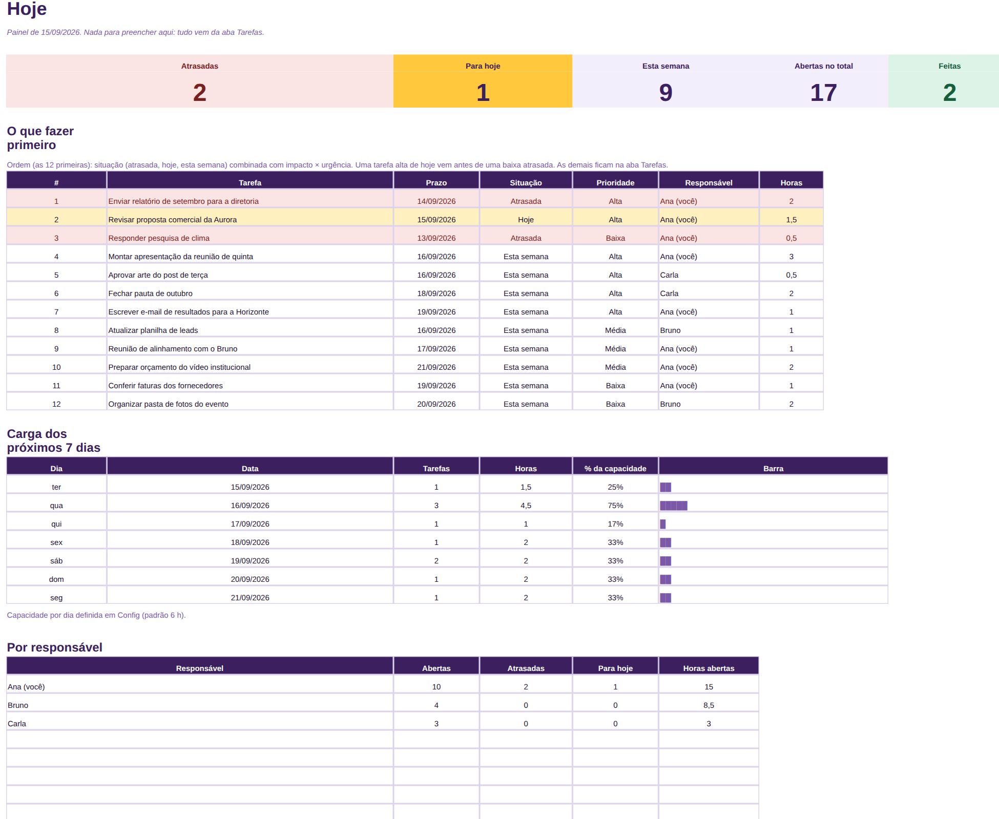
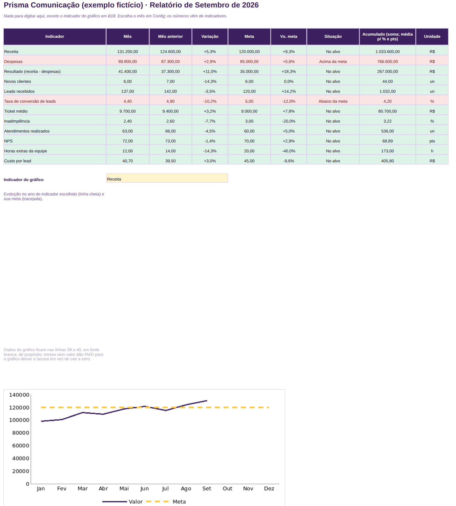
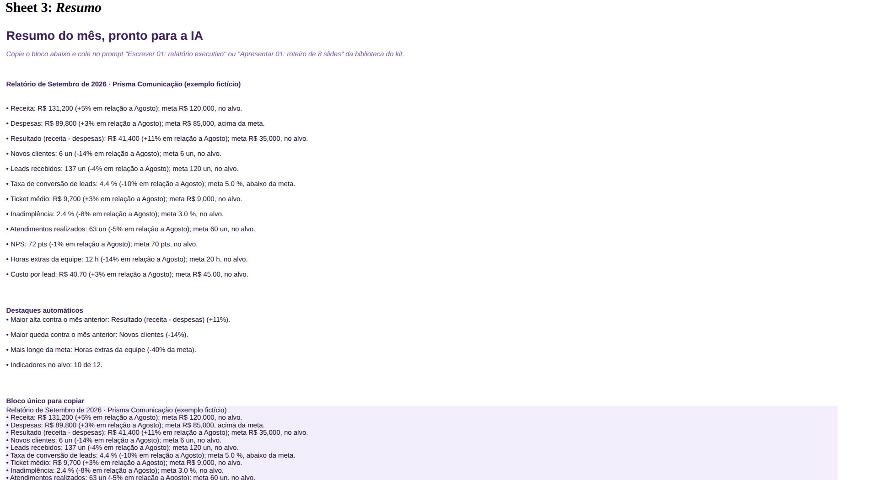
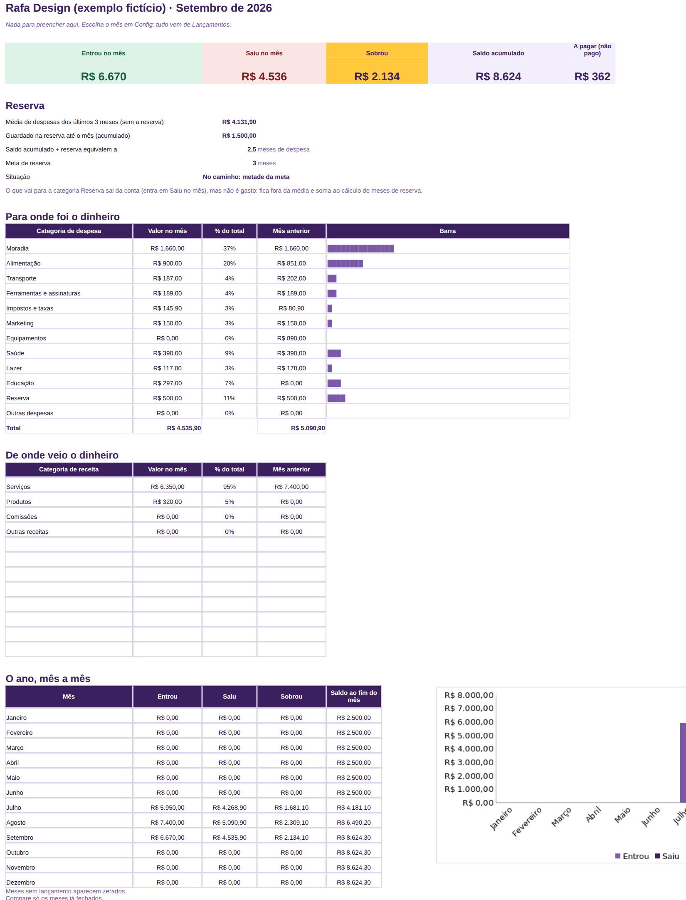

# Mini-manual · Kit IA no Trabalho · Essencial

Versão 1.0 · setembro de 2026 · Seu Sócio Gestor

## 1. O que você recebeu

| Arquivo | O que é | Tempo para começar |
|---|---|---|
| 01-semana-organizada.xlsx | Tarefas, prioridades e painel do dia | 15 min |
| 02-relatorio-mensal-pronto.xlsx | Indicadores do mês, painel, gráfico e resumo para a IA | 15 min |
| 03-ganhos-e-gastos.xlsx | Entradas, saídas, saldo, reserva e categorias | 15 min |
| 04-biblioteca-de-prompts.pdf (+ .txt) | 40 prompts em 6 grupos, prontos para copiar | 5 min |
| 05-mini-manual.pdf | Este guia | agora |
| 06-modelo-apresentacao-8-slides.pptx | Bônus: apresentação do relatório mensal | 10 min |
| 07-checklist-antes-de-enviar.pdf | Bônus: uma página para conferir antes de mandar | 2 min |
| videos/ | Três demonstrações de tela, uma por planilha | 1 min cada |

Tudo é seu: baixe, copie, edite e guarde onde quiser. Não há login, mensalidade ou atualização
automática. Quando corrigirmos algo, a nova versão aparece na sua área de download.

## 2. Como abrir

**No computador (Excel):** baixe o arquivo, abra e clique em "Habilitar edição" se o Excel
perguntar. Não há macros; nada precisa ser "habilitado" além disso. Salve uma cópia com o seu nome
(Arquivo > Salvar como) antes de começar.

**No Google Sheets:** entre no Google Drive, clique em Novo > Upload de arquivo, escolha a
planilha e, depois de subir, abra com o Google Sheets. Fórmulas, listas suspensas, cores e gráficos
funcionam. Se preferir, converta em arquivo do Sheets por Arquivo > Salvar como Planilha Google.

**No celular:** abre nos aplicativos do Excel e do Google Sheets. Serve para consultar o painel e
lançar um item rápido. Para preencher de verdade, use o computador.

**Versões:** Excel 2016 ou mais novo (inclusive Microsoft 365) e Google Sheets. LibreOffice
também abre, com pequenas diferenças visuais.

## 3. Regras que valem para as três planilhas

- **Amarelo é seu.** Só as células amarelas devem ser preenchidas. As brancas são calculadas.
- **Fórmulas protegidas, sem senha.** Se precisar mexer: no Excel, Revisar > Desproteger planilha;
  no Sheets, Dados > Proteger intervalos > remover a proteção. Depois, proteja de novo.
- **Apague os exemplos antes de começar.** As pessoas e empresas dos exemplos (Ana, Prisma
  Comunicação, Rafa Design) são inventadas. Selecione as linhas amarelas com exemplo e delete só o
  conteúdo (tecla Delete), não as linhas.
- **Datas e números.** Digite datas como 14/09/2026. Em planilha com idioma português, use vírgula
  para decimais (4,5); em inglês, ponto (4.5). Se um número ficar alinhado à esquerda, a célula
  virou texto: apague e digite de novo.
- **Listas suspensas.** Responsáveis, status e categorias vêm da aba Config. Mude lá, não na
  lista.
- **Nunca dados de terceiros na IA.** As planilhas guardam só o que é administrativo. Nos prompts,
  troque nomes reais por "Cliente A".

## 4. Planilha 1 em 15 minutos: Semana Organizada

1. **Config.** Deixe a data de referência em =HOJE(). Informe quantas horas de trabalho focado
   cabem no seu dia (6 é um bom começo). Ajuste a lista de responsáveis e de projetos.
2. **Tarefas.** Apague os exemplos. Para cada tarefa: nome começando com verbo, projeto ou cliente,
   responsável, prazo, impacto (1 a 3), urgência (1 a 3), horas e status. Prioridade, dias para o
   prazo, situação e ordem aparecem sozinhos.
3. **Hoje.** Não se preenche. Mostra atrasadas, para hoje, esta semana, abertas e feitas; a lista
   "o que fazer primeiro"; a carga dos próximos 7 dias contra a sua capacidade; e o resumo por
   pessoa.
4. **Rotina.** Todo dia, mude para "Feito" o que terminou. Toda sexta, revise prazos e horas.

**Como a ordem é calculada:** situação (atrasada, hoje, esta semana) combinada com impacto ×
urgência. Uma tarefa alta de hoje vem antes de uma baixa atrasada; uma alta atrasada vem antes de
tudo.

**Com a IA:** prompt Organizar 01 transforma uma lista bagunçada nas linhas da planilha.
Organizar 02 monta o seu dia em blocos. Organizar 05 faz a revisão de sexta.

## 5. Planilha 2 em 15 minutos: Relatório Mensal Pronto

1. **Config.** Nome da empresa ou área, ano e o mês do relatório.
2. **Indicadores.** Até 12 linhas. Para cada indicador: nome, unidade (R$, %, un, h, pts), casas
   decimais, meta mensal, se maior é melhor (Sim para receita, Não para despesa ou inadimplência) e
   o valor de cada mês. Em porcentagem, digite 4,5 e não 0,045.
3. **Painel.** Mês, mês anterior, variação, meta, situação (verde no alvo, vermelho fora),
   acumulado e unidade. Escolha um indicador para o gráfico de evolução no ano.
4. **Resumo.** As frases do mês já estão escritas. Copie o "bloco único" e cole no prompt Escrever
   01 (relatório executivo) ou Apresentar 01 (roteiro de 8 slides), junto com os seus comentários
   sobre o porquê dos números.

**Todo mês:** digite os valores do mês novo em Indicadores e troque o mês em Config. Nada mais.

## 6. Planilha 3 em 15 minutos: Ganhos e Gastos

1. **Config.** Nome, ano, saldo inicial (o que você tinha antes do primeiro lançamento) e meta de
   reserva em meses de despesa (3 é um bom começo). Ajuste as categorias.
2. **Lançamentos.** Uma linha por entrada ou saída: data, tipo, categoria, descrição, valor, forma
   e se já foi pago. Lance na hora ou uma vez por semana.
3. **Painel.** Escolha o mês em Config. Veja entrou, saiu, sobrou, saldo acumulado, a pagar,
   reserva (quantos meses de despesa o saldo cobre), para onde foi o dinheiro e o ano mês a mês.
4. **Antes de um gasto grande,** olhe a linha "Reserva". Se estiver abaixo da meta, o painel avisa.

**Com a IA:** Analisar 03 ajuda a decidir onde cortar; Escrever 05 explica o mês para um sócio,
cliente ou a família; Escrever 10 escreve a cobrança de quem está devendo.

## 7. A rotina: Preencher, Perguntar, Entregar

| Quando | O que fazer | Tempo |
|---|---|---|
| Segunda de manhã | Abrir a aba Hoje; ajustar prazos; rodar Organizar 02 para montar o dia | 10 min |
| Todo dia | Marcar tarefas feitas; lançar entradas e saídas do dia | 5 min |
| Sexta à tarde | Revisar a semana (Organizar 05); conferir contas a pagar | 15 min |
| Último dia útil do mês | Digitar os indicadores do mês; ler o Painel; copiar o Resumo; rodar Escrever 01 e Apresentar 01; montar os 8 slides | 45 min |

A rotina inteira cabe em 30 minutos por semana mais 45 no fim do mês. O ganho não está em fazer
mais rápido uma vez: está em nunca mais começar do zero.

## 8. Como usar a biblioteca de prompts

Cada prompt tem quatro partes: **quando usar**, o **prompt** (com campos entre colchetes), um
**exemplo** e **o que conferir**. Copie o prompt inteiro, cole na IA, troque os colchetes, cole os
seus dados no fim e envie. Se a resposta vier ruim, não reescreva: responda "Refaça: [o que
faltou]". Para criar os seus, use o modelo em branco do fim da biblioteca.

O arquivo .txt tem os mesmos prompts sem formatação, para copiar mais rápido no celular.

## 9. Erros comuns e como resolver

| Sintoma | Causa | Solução |
|---|---|---|
| Número alinhado à esquerda e fórmulas ignorando a célula | Célula virou texto | Apague e digite de novo, sem espaço e com o separador decimal do seu idioma |
| A lista suspensa não aparece | Célula fora da faixa ou proteção alterada | Use as linhas amarelas já preparadas (300 tarefas, 500 lançamentos) |
| Painel zerado | Mês ou ano em Config diferente dos lançamentos | Confira Config e as datas digitadas |
| Gráfico com queda a zero nos meses futuros | Só acontece em programas antigos | No Excel e no Sheets os meses vazios ficam em branco de propósito |
| "#VALOR!" ou "#VALUE!" em uma linha | Texto onde deveria haver número (ex.: "1,5h") | Deixe só o número na célula |
| Apaguei uma fórmula sem querer | Proteção removida | Baixe de novo o arquivo original e copie só as suas células amarelas |
| Acentos estranhos ao abrir | Arquivo aberto como CSV | Abra o .xlsx, não converta |

## 10. Bônus

**Modelo de apresentação de 8 slides** (PowerPoint; abre no Google Slides por upload): capa,
resumo do mês, dois destaques, dois pontos de atenção, próximos passos e pedido. Os textos vêm do
prompt Apresentar 01. Troque o texto, mantenha a estrutura.

**Checklist antes de enviar:** uma página com 12 itens para planilha, texto e slide. Imprima ou
deixe aberto ao lado.

## 11. Perguntas frequentes

**Posso usar em mais de um computador?** Sim. A licença é sua, para o seu trabalho ou negócio,
em quantos dispositivos quiser. Não pode revender, distribuir ou usar para prestar serviço de
implantação a terceiros.

**Preciso de assinatura de IA?** Não. As versões gratuitas de ChatGPT, Copilot e Gemini bastam.

**Serve para o meu tipo de trabalho?** As três planilhas são genéricas de propósito: tarefas,
indicadores e dinheiro existem em qualquer trabalho. Os kits por profissão (advogados, médicos,
dentistas) trazem planilhas específicas.

**Vou receber atualizações?** Correções deste kit aparecem na sua área de download, sem custo.
Novos kits são produtos separados.

**Como pedir reembolso?** Em até 7 dias corridos da compra, pela página do pedido ou por e-mail,
sem precisar explicar. O valor volta pelo mesmo meio de pagamento.

**Suporte:** suporte@seusociogestor.com.br, resposta em até 5 dias úteis. Escreva com o e-mail da
compra e o nome do arquivo. Não há suporte por telefone ou WhatsApp.

ZTRAINING SERVICE LTDA · CNPJ 68.796.613/0001-10 · seusociogestor.com.br
