# Manual de implantação · Kit de Gestão para Médicos

Versão 1.0 · setembro de 2026 · Seu Sócio Gestor

Este manual é para ser lido uma vez, em 20 minutos, e consultado depois. Ele explica o método
(cinco núcleos, um fechamento por semana), organiza a implantação em quatro semanas com as 20
planilhas distribuídas, mostra o que cada planilha faz, ensina a usar a IA sem expor paciente nem
dado de saúde e fecha com a rotina de segunda, de sexta, do dia 5 e do fim do trimestre. As 8 aulas
em vídeo mostram tudo isso na tela; o manual é o mapa.

Uma frase antes de começar: **o kit organiza a gestão da clínica, não a medicina.** Nada aqui é
prontuário, guarda diagnóstico ou conduta, nem redige divulgação. As planilhas medem e avisam; o
atendimento, a indicação de cada procedimento e a conversa com o paciente continuam sendo seus, e
qualquer texto que vá para o público passa pelas regras do CFM (Resolução CFM 2.336/2023) e do seu
CRM antes.

## 1. O que você recebeu

| Arquivo | O que é | Tempo |
|---|---|---|
| 01 a 04 | Núcleo Agenda: Agenda e ocupação, Faltas e retornos, Rotina da semana, Checklist do dia | 12 min na segunda; 3 min na abertura e 10 no fechamento do dia (recepção) |
| 05 a 08 | Núcleo Preço: Custo da hora de atendimento, Precificação, Simulador convênio × particular, Tabela de preços | 15 min na primeira vez; revisão trimestral ou ao mexer em convênio |
| 09 a 12 | Núcleo Caixa: Caixa da clínica, Provisão de impostos, 13º e férias, Repasse e pró-labore, Reserva e metas de caixa | parte dos 18 min de sexta; 1 hora no dia 5 |
| 13 a 16 | Núcleo Recebíveis: Convênios a receber, Parcelas e inadimplência, Orçamentos, Conciliação de cartão | parte dos 18 min de sexta; lote de convênio no dia 5 |
| 17 a 20 | Núcleo Painel: Painel da clínica, Resultado mensal, Metas do trimestre, Resumo do mês | parte dos 18 min de sexta; 30 min no dia 5 |
| 21 | Biblioteca de 40 prompts da clínica (5 grupos de 8: Agenda, Preço, Caixa, Recebíveis, Painel), PDF e txt | 5 min por prompt |
| 22 | Bônus: 15 mensagens de confirmação e cobrança (WhatsApp e e-mail), PDF e txt | 2 min por mensagem |
| 23 | Bônus: Guia LGPD para a clínica pequena | 30 min, uma vez |
| 24 | Bônus: Roteiro da reunião mensal com o contador | 30 min por mês |
| 25 | Checklists: abertura e fechamento do dia, fechamento do mês, antes de fechar um convênio | 2 min cada |
| 26 | Este manual | 20 min, uma vez |
| 27 a 29 | Modelos de apresentação (.pptx): resultado do mês para os sócios (8 slides), proposta de parceria para médico (10), convênios e caixa para o contador (8) | 20 min por apresentação |
| videos/ | 8 aulas de 2 a 3 minutos, tela real, narração e legenda | cerca de 20 min no total |

**As 8 aulas (pasta videos/, em mp4 com legenda .srt).** Assista na ordem; cada semana da
implantação diz qual aula ver.

| Aula | Título | Duração | Planilhas |
|---|---|---|---|
| 1 | Antes de abrir a planilha: os cinco núcleos e a rotina | 2 a 3 min | método e 03 |
| 2 | Agenda, ocupação e faltas | 2 a 3 min | 01, 02, 04 |
| 3 | Custo da hora de atendimento | 2 a 3 min | 05 |
| 4 | Preço e simulador de convênio | 2 a 3 min | 06, 07 |
| 5 | Quanto cobrar por este procedimento | 2 a 3 min | 05, 06, 08 |
| 6 | Caixa, provisão e repasse | 2 a 3 min | 09, 10, 11, 12 |
| 7 | Convênios, parcelas e cobrança | 2 a 3 min | 13, 14, 15, 16 |
| 8 | Painel de sexta e fechamento | 2 a 3 min | 17, 18, 19, 20 |

Abre tudo no Excel 2016 ou mais novo, no Microsoft 365 e no Google Sheets: as fórmulas usam só
funções que existem desde o Excel 2007 (SOMASES, CONT.SES, ÍNDICE e CORRESP, SEERRO, SOMARPRODUTO),
nenhuma exclusiva das versões mais novas. No celular, os aplicativos abrem e mostram; para preencher,
use o computador. Sem macros, sem instalação, sem login, sem mensalidade.

Todas as planilhas vêm preenchidas com a mesma clínica fictícia, Clínica Vida Plena: dois sócios (a
Dra. Carolina Mendes, clínica médica, e o Dr. Paulo Andrade, cardiologia), uma médica parceira por
repasse (a Dra. Renata Sousa, endocrinologia, dois turnos por semana), a recepcionista Bruna Carvalho,
três convênios fictícios (Saúde Total, MediPlan, Vida Care), 156 pacientes fictícios e duas salas, na
mesma data em todas: segunda-feira 14/09/2026, com a agenda e o caixa de setembro em andamento e
agosto como último mês fechado (é o mês que o Resultado mensal e o Resumo do mês analisam).
Pacientes, contatos, convênios e valores são inventados; não há nenhum dado clínico em lugar nenhum:
"procedimento" é só o nome administrativo do horário (consulta, retorno, ECG, MAPA, Holter, teste
ergométrico, avaliação endócrina). As datas de agenda futura, vencimentos em aberto e orçamentos
abertos são relativas a hoje (fórmula), por isso o exemplo não envelhece. Você apaga o exemplo e
digita o seu.

## 2. O método: cinco núcleos, um fechamento por semana

Clínica pequena não quebra por falta de paciente. Quebra porque a agenda tem buraco que ninguém
mede, o preço da consulta veio da tabela do vizinho, o convênio paga em 60 dias com glosa que
ninguém recorre, o repasse do colega e o pró-labore saem da mesma conta que o almoço de domingo, e
o sócio só descobre tudo isso quando a guia do imposto chega junto com o 13º. O método ataca esses
cinco pontos com cinco núcleos de planilhas e prende tudo em dois momentos fixos da semana.

**1. Agenda que se mede (planilhas 01 a 04).** Horas disponíveis × atendidas por profissional, sala,
dia e período; faltas, remarcações e lista de retorno; a rotina de segunda e de sexta; o checklist de
abertura e fechamento do dia da recepção.

**2. Preço pela hora, não pela tabela do vizinho (05 a 08).** Custo da hora de atendimento (custos
fixos + pró-labore dos sócios ÷ horas de atendimento planejadas; no exemplo, R$ 28.000 ÷ 140 h =
R$ 200) + material + margem = preço de consulta e procedimento. O simulador compara convênio ×
particular com prazo de pagamento, glosa esperada e custo do dinheiro, em duas leituras: agenda cheia
e agenda vazia.

**3. Caixa com provisão e repasse (09 a 12).** Entradas por origem (particular à vista, a prazo, cada
convênio), saídas por categoria, provisão de impostos, 13º e férias separada, repasse aos médicos
parceiros e pró-labore dos sócios separados do que é pessoal, reserva de três meses de custo fixo.

**4. Recebíveis sem surpresa (13 a 16).** Guias enviadas × pagas × glosadas por convênio, com recurso
de glosa; parcelas particulares com régua de cobrança educada; orçamentos apresentados × aprovados;
conciliação de cartão e taxas.

**5. Painel de sexta (17 a 20).** Uma tela com ocupação, faltas, caixa, convênio a receber, glosa,
vencido e orçamentos. No fim do mês, o resultado, as metas e o Resumo do mês, que vira texto para o
sócio e para o contador com o prompt "Painel 01 · Explicar o mês ao sócio".

**Um fechamento por semana, em dois momentos.** Segunda-feira, 12 minutos: agenda (vagas dos
próximos 7 dias, confirmações da semana, lista de retorno, faltas da semana passada), quase tudo
com a recepção. Sexta-feira, 18 minutos: caixa e painel (lançar os fechamentos do dia, marcar
parcelas e lotes que caíram, separar as guias, atualizar orçamentos, olhar o Painel da clínica e
anotar até três decisões). Trinta minutos por semana. A planilha 03 registra se a rotina foi feita;
o que não vira hábito em quatro semanas é encurtado ou delegado, não abandonado.

**Anatomia de toda planilha do kit.** Aba **Como usar** (passo a passo), aba principal (**Painel**,
ou Precificação, Simulador, Tabela, Resumo), aba **Config** (nome da clínica, data de referência,
listas e regras) e as abas de **lançamento**. Você só digita nas células amarelas; as brancas são
calculadas e ficam protegidas sem senha. Os campos de escolha têm lista suspensa; preencha as listas
de Config de cima para baixo, sem pular linha. Não há link entre arquivos: quando uma planilha
precisa de um número de outra, ela tem uma aba amarela de entrada e diz de onde copiar.

**Quem alimenta quem.** Sem link entre arquivos, cada dado tem uma fonte única e as outras planilhas
copiam dela. Esta é a ordem natural de copiar:

| De (fonte única) | Para | O que copiar |
|---|---|---|
| 01 Agenda (abas Agenda e Pacientes) | 02, 14, 16 | A 02 copia a Agenda inteira (é dela que saem faltas e lista de retorno); a 14 copia os Pacientes que pagam a prazo; a 16 copia os atendimentos particulares pagos com Pix ou cartão. Um paciente novo nasce na 01 |
| 01 Agenda (atendimentos de convênio) | 13 Guias | Uma guia por atendimento de convênio realizado: data, convênio, procedimento, profissional, valor |
| 01 Agenda (Painel, por profissional) | 11 Repasse, 08 Tabela | Produção e horas atendidas do médico parceiro no mês (repasse); realizados e produção por procedimento do mês fechado (08) |
| 05 Custo da hora | 06, 07, 08, 11 | Custo-hora (R$ 200 no exemplo), alíquota, margens; custo da estrutura por hora (R$ 71,43) para a 11 |
| 13 Convênios (Config e Painel) | 07 | Prazo contratual e glosa histórica de cada convênio |
| 14 Parcelas, 13 Lotes, 16 Conciliação | 09 Caixa | Parcela paga = entrada no dia do pagamento; lote pago = entrada pelo valor pago (menos a glosa); taxas do mês = uma saída no fim do mês |
| 09 Caixa (Painel) | 10, 11, 12, 18 | Entradas do mês (sem Outras entradas) para a provisão; entradas e saídas sem os sócios para a 11; saldo e custo fixo para a 12; entradas por origem e saídas por categoria para a 18 |
| 01, 02, 09, 13, 14, 15 (Painéis) | 17 Painel (aba Dados) | Os 14 totais de sexta, copiados dos painéis de origem; no exemplo, os números da 17 são exatamente os desses painéis na sexta 11/09 |
| 17 Painel (Histórico), 18 Resultado | 19, 20 | Valor atual das metas; os 12 indicadores do mês |

**A regra de ouro do kit:** a planilha entrega os números; a IA entrega as palavras; você confere os
dois. E a regra de ouro do sigilo: nenhum nome de paciente, contato ou dado de saúde entra em uma IA
pública (seção 5), e nada clínico entra nas planilhas.

## 3. Implantação em 4 semanas

Não abra as vinte de uma vez. As 20 planilhas entram em quatro semanas, cinco ou seis por semana,
começando pelo que dói mais (agenda com buraco) e pelo número que muda tudo (custo da hora).
Assista à aula 1 (Antes de abrir a planilha: os cinco núcleos e a rotina) antes da semana 1. Para
apagar o exemplo, selecione as células amarelas e apague o conteúdo (Delete), não a linha inteira: a
formatação e as listas ficam. Em Config de cada planilha, troque "Clínica Vida Plena (exemplo
fictício)" pelo nome da clínica, e os profissionais, salas e convênios pelos seus, escritos igual em
todas.

| Semana | Planilhas | Aulas | Tempo |
|---|---|---|---|
| 1 · Agenda e custo da hora | 01, 02, 03, 04, 05 | 2 · Agenda, ocupação e faltas · 3 · Custo da hora de atendimento | 2 h 30 |
| 2 · Preço, convênio e caixa | 06, 07, 08, 09, 10 | 4 · Preço e simulador de convênio · 5 · Quanto cobrar por este procedimento · 6 · Caixa, provisão e repasse (primeira metade) | 2 h 30 |
| 3 · Repasse, reserva e recebíveis | 11, 12, 13, 14, 15, 16 | 6 · Caixa, provisão e repasse (segunda metade) · 7 · Convênios, parcelas e cobrança | 2 h 30 |
| 4 · Painel e fechamento | 17, 18, 19, 20 | 8 · Painel de sexta e fechamento | 1 h 30 |

### Semana 1 · Agenda e custo da hora (planilhas 01, 02, 03, 04, 05) · 2 horas e meia

**Abrir:** 01 Agenda e ocupação, 02 Faltas e retornos, 03 Rotina da semana, 04 Checklist do dia, 05
Custo da hora. Aulas 2 (Agenda, ocupação e faltas) e 3 (Custo da hora de atendimento).
**Apagar:** as abas Pacientes e Agenda (01), Agenda (02), Checklist (04), Custos fixos e Equipe (05).
Em Config da 01, os turnos da semana, as salas e os feriados são os seus.
**Digitar:** na 01, profissionais, salas, pagadores, procedimentos com duração e a tabela de preços
em Config; os turnos de cada profissional (dia, período, sala); os pacientes com nome, pagador e
contato; e a agenda do mês atual, do dia 1 até hoje, com a situação de cada horário (Realizado,
Falta, Cancelado, Remarcado) e os próximos 15 dias com Agendado ou Confirmado. Na 02, cole a Agenda
da 01 e, em Config, o retorno esperado de cada procedimento em dias. Na 03, as linhas da rotina de
segunda e de sexta com responsável. Na 04, os itens de abertura e fechamento do jeito da clínica e os
últimos dias úteis. Na 05, os custos fixos do mês e as pessoas: pró-labore dos sócios, horas de
atendimento planejadas, quem entra no custo-hora (sócios sim; médico parceiro por repasse não; a
recepção já está nos custos fixos).
**Tempo:** 60 a 90 minutos para a agenda e os pacientes (o maior esforço da implantação; depois é a
recepção que mantém, todo dia), 10 para a rotina, 20 para o checklist, 20 para o custo da hora.
**Sai sabendo:** quantas horas a clínica atende de verdade e onde a agenda esvazia, a taxa de falta
por dia e por convênio, quem está na lista de retorno, e quanto custa uma hora de atendimento. Anote
o custo-hora e a hora mínima: as planilhas 06, 07, 08 e 11 pedem.

### Semana 2 · Preço, convênio e caixa (planilhas 06, 07, 08, 09, 10) · 2 horas e meia

**Abrir:** 06 Precificação, 07 Simulador convênio × particular, 08 Tabela de preços, 09 Caixa da
clínica, 10 Provisão. Aulas 4 (Preço e simulador de convênio), 5 (Quanto cobrar por este
procedimento) e a primeira metade da 6 (Caixa, provisão e repasse).
**Apagar:** as linhas da Precificação e o bloco Simular (06), o procedimento e as tabelas do
Simulador (07), a Tabela e o volume do mês (08), Lançamentos (09), Entradas e pagamentos (10).
**Digitar:** em Config das 06, 07 e 08, o custo-hora, a alíquota efetiva e as margens da 05. Na 06,
cada procedimento com minutos, retorno, material, o preço particular que você pratica hoje e a tabela
de cada convênio. Na 07, os convênios com prazo de pagamento e glosa esperada (se ainda não souber,
use o prazo do contrato e 5 %; a 13 vai medir) e o procedimento mais frequente. Na 08, a mesma tabela
da 06 e, quando o mês fechar, os realizados por procedimento do Painel da 01. Na 09, o saldo antes do
primeiro lançamento e todo movimento do mês atual: uma linha por dia e forma de pagamento para o
particular à vista, uma por parcela paga, uma por lote de convênio pago, uma por saída. Na 10, a
alíquota efetiva que o contador informar, 13º e férias da equipe e as entradas dos meses já fechados.
**Tempo:** 30 minutos para a precificação, 15 para o simulador, 15 para a tabela, 60 para o caixa, 20
para a provisão.
**Sai sabendo:** o custo cheio de cada procedimento e a margem do preço que você pratica, quais
tabelas de convênio não cobrem o custo, o que cada convênio deixa por hora contra a hora mínima, para
onde foi o dinheiro do mês e quanto deveria estar separado para imposto.

### Semana 3 · Repasse, reserva e recebíveis (planilhas 11, 12, 13, 14, 15, 16) · 2 horas e meia

**Abrir:** 13 Convênios a receber primeiro (é onde a glosa e o prazo real aparecem), depois 14
Parcelas, 15 Orçamentos, 16 Conciliação de cartão e, por fim, 11 Repasse e pró-labore e 12 Reserva.
Aulas 7 (Convênios, parcelas e cobrança) e a segunda metade da 6 (Caixa, provisão e repasse, para a
11 e a 12).
**Apagar:** Guias e Lotes (13), Pacientes e Parcelas (14), Orçamentos (15), Vendas (16), Repasse,
Resultado mensal e Retiradas (11); em Config da 12, os valores do exemplo.
**Digitar:** na 13, cada convênio com prazo contratual e dia de envio; as guias dos atendimentos de
convênio realizados (da Agenda da 01) e os lotes enviados nos últimos meses com o que foi pago e
glosado. Na 14, os pacientes que pagam a prazo (da 01) e as parcelas combinadas, marcando as pagas;
em Config, a régua de cobrança do seu jeito. Na 15, os orçamentos apresentados nos últimos 60 dias
com etapa e, se recusados, o motivo. Na 16, as taxas e prazos da sua maquininha e as vendas no cartão
e Pix do mês (da Agenda). Na 11, os sócios com pró-labore, os parceiros com % de repasse e dia de
pagamento, a produção e as horas de cada parceiro no mês (Painel da 01) e os movimentos entre clínica
e sócios; na 12, o custo fixo dos últimos três meses, o saldo, o que já está guardado e o aporte que
cabe.
**Tempo:** 40 minutos para convênios, 30 para parcelas, 15 para orçamentos, 15 para o cartão, 30 para
repasse, pró-labore e reserva.
**Sai sabendo:** quanto cada convênio deve, quanto atrasou e quanto glosou; quem cobrar primeiro e
com qual mensagem; quantos orçamentos fecham e por que os outros não; quanto a maquininha custa;
quanto o repasse deixa para a clínica; o que cada sócio retirou além do combinado e quantos meses de
custo fixo a reserva cobre.

### Semana 4 · Painel e fechamento (planilhas 17, 18, 19, 20) · 1 hora e meia

**Abrir:** 17 Painel da clínica, 18 Resultado mensal, 19 Metas do trimestre, 20 Resumo do mês. Aula 8
(Painel de sexta e fechamento).
**Apagar:** os valores de Dados e Histórico (17), as colunas dos meses (18), as metas (19), os
valores de Indicadores (20; os 12 nomes do exemplo são um bom começo).
**Digitar:** na 17, o limite de cada indicador (75 % de ocupação, 6 % de falta, 4 % de glosa, 8 % de
inadimplência a prazo, por exemplo) e, na sexta, os totais dos painéis das planilhas 01, 02, 09, 13,
14 e 15. Na 18, os meses já fechados do ano (entradas por origem e saídas por categoria, do Painel da
09) e o previsto. Na 19, até 3 objetivos com até 3 resultados-chave. Na 20, os 12 indicadores com
meta, mês anterior e mês atual.
**Tempo:** 30 minutos para painel e metas, 30 para o resultado, 20 para o resumo. No primeiro dia 5
depois disso, o primeiro fechamento do mês completo (seção 6).
**Sai sabendo:** a clínica em uma tela, o lucro de verdade do mês, se o trimestre está no ritmo e um
texto pronto para o sócio e para o contador. A partir daqui, é rotina.

## 4. As 20 planilhas, uma a uma

Para cada planilha: o que ela responde, o que você preenche, o que sai, os prompts da biblioteca que
combinam e o detalhe que evita o erro mais comum. O passo a passo completo está na aba "Como usar" de
cada arquivo.

### 4.1 Agenda e ocupação por profissional e sala (arquivo 01)
**Responde:** quantas horas a clínica tinha, quantas atendeu, onde a agenda esvazia e quanto produziu?
**Você preenche:** em Config, profissionais, salas, pagadores, procedimentos com duração, tabela de
preços, turnos da semana e feriados; em Pacientes, nome, pagador e contato; em Agenda, uma linha por
horário, e no fim do dia a situação e a forma de pagamento.
**Sai:** horas disponíveis (só dias já passados), atendidas, ocupação, horas vazias, faltas e produção
do mês (no exemplo, setembro até 11/09: 64,0 h, 51,8 h, 81 %, 12,2 h, 6 faltas, R$ 20.045); por
profissional, sala, dia e período, procedimento e pagador; os próximos 7 dias com as vagas.
**Prompt:** Agenda 01 (onde a agenda esvazia), Agenda 07 (pauta de segunda), Preço 08 (convênio novo).

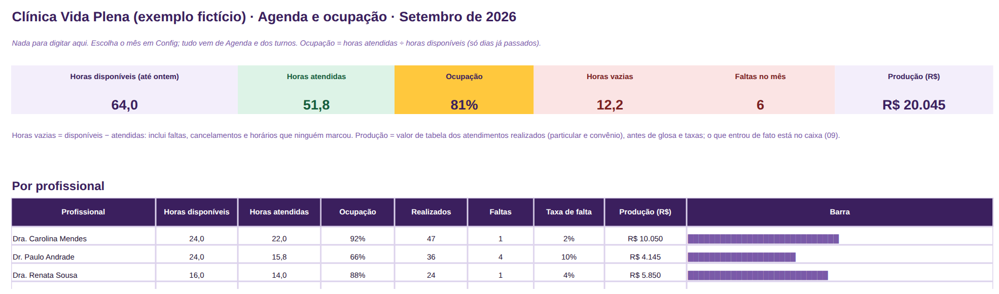

**Detalhe que importa:** é a fonte da agenda e do cadastro de pacientes: a 02 e a 16 copiam a Agenda,
a 14 copia os Pacientes, a 13 recebe as guias dos atendimentos de convênio. Horas disponíveis contam
só dias já passados, por isso a ocupação de um mês em andamento é comparável. No exemplo, a Sala 2
tem 66 % de ocupação e 8,2 horas vazias contra 90 % da Sala 1: é capacidade parada, e o Dr. Paulo
Andrade concentra 4 das 6 faltas. Nada clínico entra aqui: procedimento é só o nome do horário.

### 4.2 Faltas, remarcações e lista de retorno (arquivo 02)
**Responde:** por que a agenda esvazia: em que dia, período, pagador e profissional a falta se
concentra, e quem passou do retorno previsto sem horário marcado?
**Você preenche:** em Config, o retorno esperado de cada procedimento (em dias); em Agenda, cole as
colunas A a K da Agenda da 01 toda sexta.
**Sai:** taxa de falta do mês (faltas ÷ (faltas + realizados)), faltas, realizados, cancelamentos,
remarcações, lista de retorno; por dia da semana, período, pagador e profissional; as últimas 8
semanas; reincidentes.
**Prompt:** Agenda 02 (reduzir faltas), Agenda 03 (mensagem de retorno).

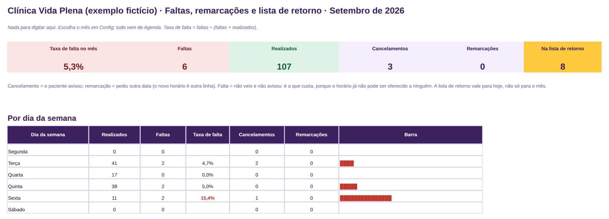

**Detalhe que importa:** a série das 8 semanas é o quadro mais útil: no exemplo, a falta caiu de
10,9 % (semana de 27/07) para 4,0 % (31/08) depois que a recepção começou a confirmação de véspera;
setembro está em 5,3 %, com a sexta de manhã em 15,4 % e o Vida Care em 12,5 %. A lista de retorno
(7 pacientes, 5 do Dr. Paulo Andrade) vale para hoje: o paciente sai dela sozinho quando o retorno é
marcado na 01. Ligar para a lista de retorno foi a rotina mais pulada da clínica fictícia.

### 4.3 Rotina da semana da clínica (arquivo 03)
**Responde:** a rotina de segunda e de sexta está sendo feita, por quem, e qual parte é pulada?
**Você preenche:** em Config, a segunda-feira da semana 1 e as pessoas; em Rotina, as linhas de
segunda e sexta com minutos e responsável e, toda semana, Sim ou Não.
**Sai:** aderência das últimas 4 semanas, série das últimas 8, minutos por semana, a rotina mais
pulada.
**Prompt:** Agenda 05 (rotina da recepção), Agenda 07 (pauta de segunda), Agenda 08 (semana revisada).

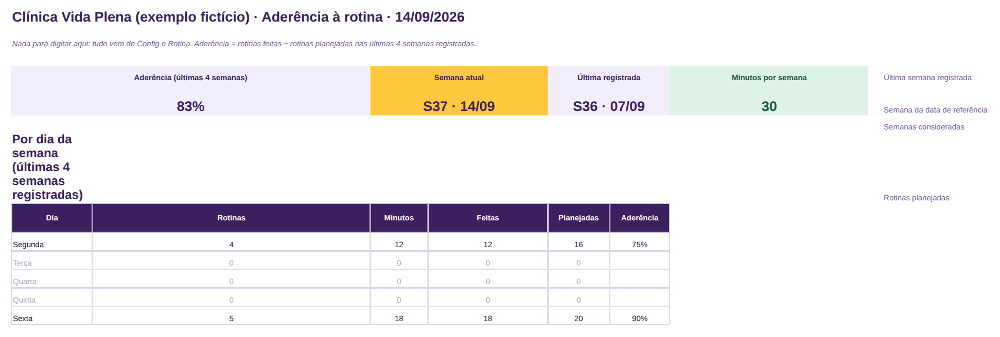

**Detalhe que importa:** a rotina é de 12 minutos na segunda e 18 na sexta, quase tudo com a
recepção (30 minutos por semana), com 83 % de aderência nas últimas 4 semanas. Abaixo de 70 % fica vermelho. A rotina mais
pulada merece ser encurtada, delegada ou trocada de dia, não bronca: no exemplo, "ligar ou mandar
mensagem para a lista de retorno" foi feita em 1 de 4 semanas.

### 4.4 Checklist de abertura e fechamento do dia (arquivo 04)
**Responde:** o dia abriu com a agenda confirmada e as guias separadas, e fechou com o caixa
conferido e lançado, a situação de cada horário marcada e os retornos agendados?
**Você preenche:** em Config, os itens de abertura e de fechamento do jeito da clínica e os
responsáveis; em Checklist, uma linha por dia e, em cada item, Sim, Não ou N/A.
**Sai:** dias registrados, abertura e fechamento completos nos últimos 20 dias, dias com pendência
(mais itens pendentes primeiro), item mais esquecido.
**Prompt:** Agenda 06 (pendências do dia viram tarefas da recepção).

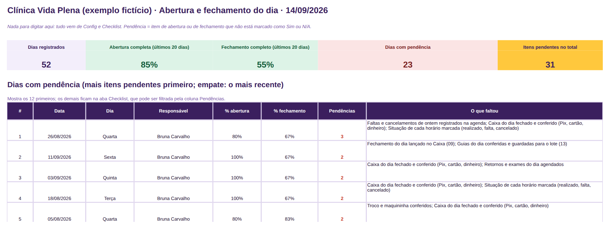

**Detalhe que importa:** vazio conta como pendente, de propósito: o dia só fecha quando tudo está
marcado. No exemplo (52 dias, de 01/07 a 11/09), a abertura fica completa em 85 % dos dias e o
fechamento em 55 %; o item mais esquecido é "Caixa do dia fechado e conferido (Pix, cartão,
dinheiro)". Se o mesmo item pende em vários dias, o problema é a rotina, não o dia. O fechamento do
dia é o que alimenta o Caixa (09) na sexta: sem ele, o caixa vira reconstrução de memória.

### 4.5 Custo da hora de atendimento (arquivo 05)
**Responde:** quanto custa uma hora da agenda da clínica e qual é a hora mínima que posso cobrar?
**Você preenche:** Custos fixos (o que paga todo mês), Equipe (pró-labore, salário ou repasse, horas
de atendimento planejadas, quem entra no custo-hora) e, em Config, margem mínima e impostos sobre o
que entra.
**Sai:** custo total, horas de atendimento, custo da hora, hora mínima a cobrar, custo de um horário
vazio, custo direto e da estrutura por hora, por pessoa e a sensibilidade (e se as faltas tirarem
horas do mês?).
**Prompt:** Preço 01 (entender o custo da minha hora), Caixa 03 (cortar custo fixo), Painel 07.

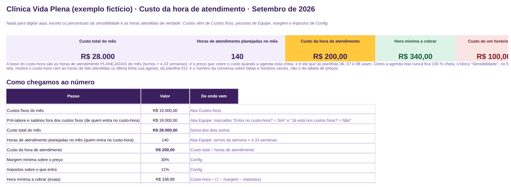

**Detalhe que importa:** custo-hora = (custos fixos + pró-labore dos sócios) ÷ horas de atendimento
planejadas dos sócios (no exemplo: (R$ 10.000 + R$ 18.000) ÷ 140 h = R$ 200,00); hora mínima =
custo-hora ÷ (1 − margem − impostos), arredondada para cima (R$ 200 ÷ (1 − 30 % − 11 %) = R$ 338,98 →
R$ 340). A médica parceira não entra: o repasse dela é custo variável (11). A recepção já está nos
custos fixos: marque "Sim" em "Já está nos custos fixos?" para não contar duas vezes. A última linha
da sensibilidade recebe as horas atendidas do mês fechado (agosto: 94,7 h dos sócios) e mostra o
custo-hora real: R$ 295,67. Um horário vazio de 30 minutos custa R$ 100.

### 4.6 Precificação de consulta e procedimento (arquivo 06)
**Responde:** quanto custa cada consulta e procedimento, qual é o preço mínimo e o alvo, e que margem
o preço particular e cada tabela de convênio deixam?
**Você preenche:** em Config, custo-hora, alíquota, margens mínima e alvo, retornos por consulta e
duração do retorno, até 4 convênios; em Precificação, uma linha por procedimento (minutos, retorno,
material, preço particular praticado, tabela de cada convênio); o bloco Simular para testar um preço
novo.
**Sai:** custo cheio, preço mínimo, preço alvo, margem do particular e de cada convênio com
situação por cor; o resumo (quantos abaixo do mínimo, quantas tabelas abaixo do custo, maior
prejuízo).
**Prompt:** Preço 02 (revisar a tabela pela margem), Preço 05 (quanto cobrar por este procedimento).

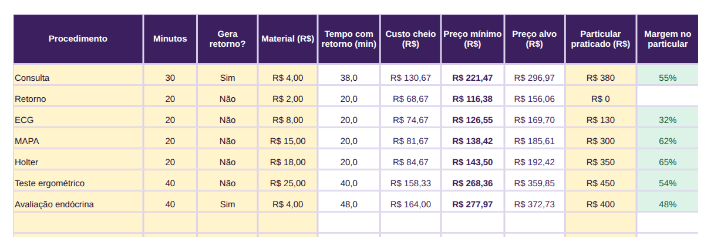

**Detalhe que importa:** custo cheio = (minutos + 0,4 × 20 min de retorno, nas consultas) ÷ 60 ×
custo-hora + material. No exemplo, a consulta de 30 minutos custa R$ 130,67 com o retorno embutido;
mínimo R$ 221,47, alvo R$ 296,97, praticado R$ 380 (margem 54,6 %); nenhum particular abaixo do mínimo,
mas 14 tabelas de convênio não cobrem o custo cheio (Saúde Total paga R$ 120 pela consulta: −19,9 %).
Convênio abaixo do custo não é "não aceitar" automático: com horários vazios a tabela ainda
contribui; a 07 faz essa conta. A divulgação de preços segue as regras do CFM.

### 4.7 Simulador convênio × particular (arquivo 07)
**Responde:** vale a pena este convênio para este procedimento, com o prazo de pagamento, a glosa
esperada e o custo do dinheiro na conta?
**Você preenche:** em Config, custo-hora, alíquota, margem, custo do dinheiro (% ao mês), pagadores
com prazo e glosa esperada, procedimentos; em Simulador, o procedimento e o valor de tabela de cada
pagador; no quadro 4, os atendimentos do mês por pagador.
**Sai:** quadro 2 (agenda cheia): líquido, margem e líquido por hora contra a hora mínima; quadro 3
(agenda vazia): contribuição por atendimento e quantos atendimentos do convênio valem um particular;
quadro 4: o resultado do mix do mês.
**Prompt:** Preço 03 (vale a pena este convênio?), Preço 06 (negociar a tabela), Preço 08.

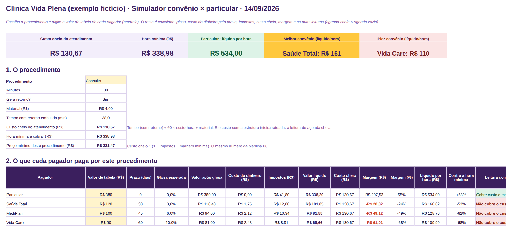

**Detalhe que importa:** duas leituras do mesmo número. Com agenda cheia, a consulta particular
deixa R$ 534 por hora e o Vida Care R$ 110 (−68 % contra a hora mínima); nenhum dos três convênios
cobre o custo cheio de R$ 130,67. Com agenda vazia, todos ainda contribuem (Saúde Total R$ 97,85 por
consulta; 3,4 consultas do Saúde Total valem uma particular; o Vida Care só com reserva, porque o
prazo de 60 dias pesa no caixa). No mix de agosto, as 62 consultas particulares deram R$ 12.867 de
resultado e as 68 de convênio, −R$ 2.987. A decisão de aceitar, renegociar ou descredenciar é da
clínica, com o contrato na mão.

### 4.8 Tabela de preços e referência por procedimento (arquivo 08)
**Responde:** a tabela interna está coerente com o custo, e quanto a clínica de fato recebe por hora
em cada procedimento e por cada pagador?
**Você preenche:** em Config, custo-hora, alíquota, margens e pagadores; em Tabela, uma linha por
procedimento com minutos, retorno, material e o valor de cada pagador; do Painel da 01 (mês fechado),
realizados e produção por procedimento; "Referência de mercado" é opcional.
**Sai:** hora mínima e hora alvo, custo cheio, mínimo e alvo por procedimento, valor médio praticado
no mês e quanto fica acima ou abaixo do mínimo, valor por hora por pagador com gráfico.
**Prompt:** Preço 04 (revisar a tabela de preços), Preço 06 (negociar a tabela), Preço 07 (desconto).

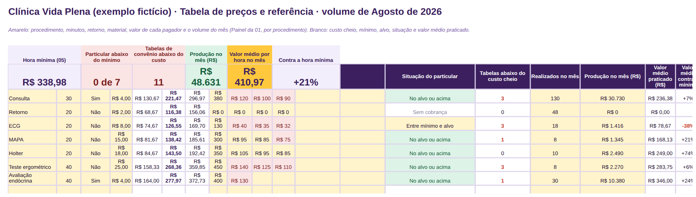

**Detalhe que importa:** a 08 usa a mesma conta da 06 (mesmo custo cheio, mínimo e alvo); a
diferença é o volume real. No exemplo, com agosto: produção R$ 48.631, valor médio por hora R$ 410,97
(21 % acima da hora mínima), consulta a R$ 236,38 em média (7 % acima do mínimo, porque metade é
convênio), ECG a R$ 78,67 (38 % abaixo: 13 dos 18 foram por convênio). A tabela de preços da agenda
(Config da 01) tem de ser esta, escrita igual. Referência de mercado é sua; a planilha não afirma
preço de mercado, e a divulgação de valores segue as regras do CFM.

### 4.9 Caixa da clínica (arquivo 09)
**Responde:** o que entrou, o que saiu, quanto sobrou, o que está a receber e a pagar, e para onde foi
o dinheiro?
**Você preenche:** saldo inicial, categorias e recebedores em Config; em Lançamentos, uma linha por
movimento com data, tipo, categoria, paciente ou convênio (quando houver), valor, forma e Pago?.
**Sai:** entrou, saiu, sobrou, saldo acumulado, a receber, a pagar; para onde foi e de onde veio, por
forma de pagamento; o ano mês a mês com gráfico.
**Prompt:** Caixa 01 (explicar o mês do caixa), Caixa 03 (cortar custo fixo), Caixa 06 (separar o
pessoal).

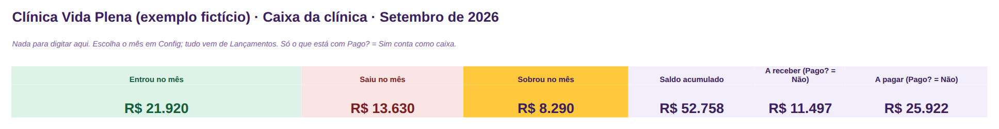

**Detalhe que importa:** só Pago? = Sim conta como caixa; lote de convênio enviado e parcela a
receber entram com Não e viram Sim quando caem (no exemplo, setembro até 11/09: entrou R$ 21.570,
saiu R$ 13.630, saldo R$ 52.251, a receber R$ 12.642, a pagar R$ 25.997; agosto fechado: entrou
R$ 50.336, saiu R$ 41.620). O particular à vista entra pelo fechamento do dia (uma linha por dia e
forma); o cartão entra pelo bruto e as taxas do mês saem numa linha só no fim do mês (o total da
16). É a planilha que alimenta a 10, a 11, a 12 e a 18.

### 4.10 Provisão de impostos, 13º e férias (arquivo 10)
**Responde:** quanto deveria estar separado, e o que está guardado cobre o próximo compromisso?
**Você preenche:** alíquota efetiva combinada com o contador, férias, 13º e equipe em Config; em
Entradas e pagamentos, por mês, o que entrou (da 09, sem Outras entradas) e o que foi pago.
**Sai:** a separar no mês, saldo provisionado, compromisso do mês seguinte, quanto falta e a
situação; o ano mês a mês com gráfico.
**Prompt:** Caixa 04 (preparar a reunião com o contador), Caixa 05 (perguntas sobre provisão).

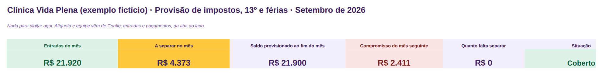

**Detalhe que importa:** provisão = entradas × alíquota efetiva (11 % no exemplo, a mesma da 05 à
08 e da 18), mais 13º (R$ 750 de cada sócio, por decisão dos sócios, e R$ 198 da recepcionista) e
férias (R$ 264 por mês); saldo provisionado ao fim de setembro R$ 21.937, compromisso do mês seguinte
R$ 2.373. A planilha separa dinheiro; não apura imposto e não afirma qual é a sua alíquota nem o seu
anexo do Simples: isso vem do contador (bônus 24). Compare o saldo provisionado com o extrato da
conta separada todo dia 5.

### 4.11 Repasse aos médicos parceiros e pró-labore dos sócios (arquivo 11)
**Responde:** quanto devo ao médico parceiro, a parceria paga a sala que usa, cada sócio retirou o
combinado ou mais, e quanto do lucro do trimestre cabe distribuir?
**Você preenche:** sócios, parceiros (% de repasse, base, dia de pagamento), regra de distribuição e
custo da estrutura por hora (da 05) em Config; em Repasse, produção e horas do parceiro no mês (da
01) e o pagamento; Resultado mensal (da 09); Retiradas, uma linha por movimento clínica × sócio.
**Sai:** repasse devido e a pagar, o que fica com a clínica, custo da estrutura das horas e margem da
parceria; combinado × retirado por sócio no mês e no ano, a acertar; lucro distribuível por
trimestre.
**Prompt:** Caixa 06 (separar o pessoal), Caixa 07 (conversa sobre o repasse), Painel 07.

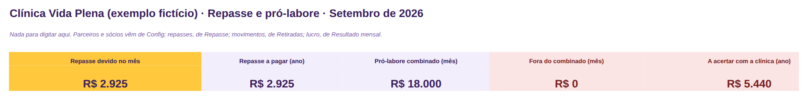

**Detalhe que importa:** repasse devido = % da produção do parceiro no Painel da 01 (no exemplo, 50 %:
agosto R$ 10.380 de produção, R$ 5.190 pagos em 10/09; setembro até 11/09, R$ 2.925 a pagar em 10/10).
No ano, a Dra. Renata produziu R$ 80.680, a clínica ficou com R$ 40.340 e a estrutura das horas dela
custou R$ 14.600: a parceria paga a sala. Fora do combinado = retiradas extras + despesas pessoais
pagas pela clínica − devoluções (R$ 5.440 a acertar no ano); a distribuição só sai de trimestre
fechado (2º trimestre: R$ 3.591 pagos em julho). Como formalizar o repasse é assunto do contador.

### 4.12 Reserva de três meses e metas de caixa (arquivo 12)
**Responde:** quantos meses de custo fixo a reserva cobre, quando chego à meta e como vão as metas de
caixa do trimestre?
**Você preenche:** tudo em Config: meta em meses (3 é um bom começo), custo fixo dos últimos 3 meses
com pró-labore (da 09), saldo, compromissos não pagos, o que já está guardado, aporte mensal e as
três metas do trimestre.
**Sai:** meta, reserva hoje, falta guardar, meses cobertos, semáforo, mês previsto para bater a meta,
projeção de 24 meses com gráfico, metas com barra de progresso.
**Prompt:** Caixa 08 (plano para a reserva de três meses).

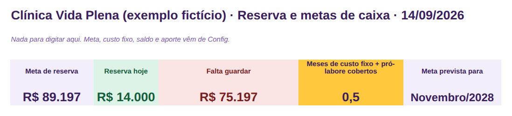

**Detalhe que importa:** a projeção supõe aporte igual todo mês, sem rendimento (no exemplo: meta
R$ 84.000 = 3 × R$ 28.000; reserva R$ 14.000, que cobre meio mês; aporte de R$ 3.000 chega em setembro
de 2028). Caixa livre = saldo (R$ 52.251) − compromissos não pagos (R$ 25.997) = R$ 26.254: é esse
número, e não o saldo, que diz o que pode virar aporte. Quando a reserva bater a meta, a decisão
(manter, reduzir, distribuir) é dos sócios.

### 4.13 Convênios a receber (arquivo 13)
**Responde:** quanto o convênio deve, quanto atrasou, quanto glosou e quais guias recorrer?
**Você preenche:** em Config, cada convênio com prazo contratual e dia de envio; em Guias, uma linha
por atendimento de convênio realizado (da Agenda da 01); em Lotes, uma linha por convênio e mês com
envio, pagamento, glosa, recurso e recuperado.
**Sai:** a receber, atrasado, recebido no ano, glosa do ano em R$ e %, em recurso; por convênio (prazo
real × contratual, glosa %), lotes em aberto (atrasados primeiro), mês a mês, guias glosadas para
recorrer.
**Prompt:** Recebíveis 01 (resumir os convênios), Recebíveis 03 (recurso de glosa), Recebíveis 08
(lote atrasado).

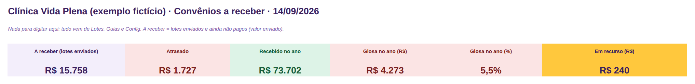

**Detalhe que importa:** glosa = glosa ÷ (pago + glosa) dos lotes pagos, a mesma conta em todo o kit
(no exemplo, 5,5 % no ano: Saúde Total 3,3 % e prazo real de 32 dias, MediPlan 7,5 % e 47 dias, Vida
Care 11,3 % e 61 dias). A receber R$ 15.758; atrasado R$ 1.727 (lote de junho do Vida Care, previsto
para 04/09); em recurso R$ 240. Lote pago vira entrada no Caixa (09) pelo valor pago; recurso aceito
vira entrada "Recurso de glosa". As duas guias glosadas para recorrer são de julho: recurso é
administrativo (código, tabela, autorização); se o motivo for clínico, é o médico quem escreve.

### 4.14 Parcelas particulares e inadimplência (arquivo 14)
**Responde:** o que vence, o que já venceu, qual é a inadimplência e quem cobrar primeiro, com qual
mensagem?
**Você preenche:** janelas e régua de cobrança em Config; Pacientes (da 01, só quem paga a prazo);
Parcelas, uma linha por parcela com vencimento e valor; ao receber, Sim e a data (e a entrada no
Caixa).
**Sai:** vence em 7 e em 30 dias, em aberto, vencido, parcelas vencidas, inadimplência, vencidas por
faixa com a ação da régua, "Cobrar primeiro" e as que vencem nos próximos 30 dias.
**Prompt:** Recebíveis 02 (quem cobrar primeiro), Recebíveis 04 (cobrança educada), Recebíveis 06, 07.

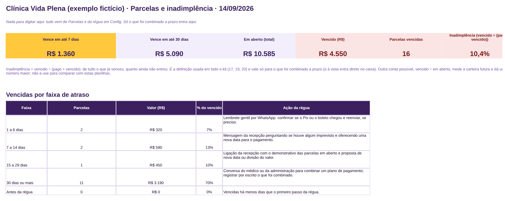

**Detalhe que importa:** inadimplência = vencido ÷ (pago + vencido), só do que foi combinado a prazo,
a mesma conta nas planilhas 17, 19 e 20 (no exemplo: R$ 4.550 ÷ (R$ 39.005 + R$ 4.550) = 10,4 %; 16
parcelas vencidas, 11 delas há 30 dias ou mais). A régua do exemplo tem quatro degraus (1 dia:
lembrete gentil por WhatsApp; 7: mensagem da recepção com nova data; 15: ligação da recepção com o
demonstrativo; 30: conversa do médico ou da administração e plano por escrito), sem ameaça e sem
constrangimento; as mensagens estão no bônus 22. A conversa com o paciente é sua; o atendimento não
é moeda de cobrança.

### 4.15 Orçamentos apresentados × aprovados (arquivo 15)
**Responde:** quanto tenho em aberto, quanto devo fechar, o que está parado e por que os orçamentos
são recusados?
**Você preenche:** meta do trimestre, limite de "parado", tipos, motivos de recusa e probabilidades em
Config; Orçamentos, uma linha por orçamento com valor, etapa e datas; ao decidir, Aprovado, Recusado
(com motivo) ou Sem retorno.
**Sai:** em aberto, previsão ponderada, aprovado no trimestre × meta, taxa de aprovação, dias até
decidir; funil, "Retomar contato primeiro", por tipo e profissional, motivos de recusa.
**Prompt:** Recebíveis 05 (por que os orçamentos não fecham), Agenda 04 (retomada de orçamento).

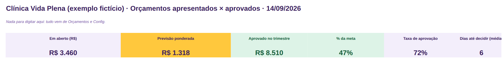

**Detalhe que importa:** previsão ponderada = valor × probabilidade da etapa (no exemplo, 6 abertos
somando R$ 3.460, previsão R$ 1.318; aprovado no trimestre R$ 8.510, 47 % da meta de R$ 18.000; taxa de
aprovação 72 %). O motivo da recusa é a parte mais valiosa da planilha: no exemplo, "vai pensar / sem
retorno" pesa mais que "preço". Orçamento é ato administrativo da recepção; a indicação do exame é
do médico, e retomar contato não é insistir (modelo 06 do bônus 22). Aprovado vira horário na 01 e,
se a prazo, parcela na 14.

### 4.16 Conciliação de cartão e taxas (arquivo 16)
**Responde:** quanto as taxas comem no mês, o que ainda vai cair na conta e o que já deveria ter caído
e não foi conferido?
**Você preenche:** taxas e prazos da operadora em Config; em Vendas, uma linha por pagamento no
cartão ou Pix (da Agenda da 01) e, toda sexta, Sim em "Conferido no extrato?".
**Sai:** vendas, taxas, taxa média, líquido, ainda vai cair, a conferir; por tipo de pagamento com
gráfico; dia a dia; "Falta conferir".
**Prompt:** Caixa 09 (a taxa da maquininha está comendo a margem?).

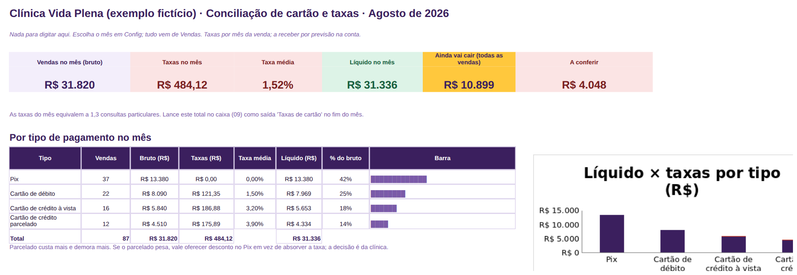

**Detalhe que importa:** no exemplo, agosto: R$ 31.820 em Pix e cartão, taxas R$ 484,12 (1,52 %), o
equivalente a 1,3 consultas particulares; o crédito parcelado (3,9 %) é 14 % das vendas e a maior taxa.
O total de taxas do mês vira uma saída "Taxas de cartão" no Caixa (09) no último dia do mês, e o
Resultado (18) mostra o mesmo número como despesa variável. O Painel do exemplo está em agosto (mês
fechado); as vendas de setembro já estão na aba.

### 4.17 Painel da clínica (arquivo 17)
**Responde:** como está a clínica nesta sexta, em uma tela, contra os limites e o mês anterior?
**Você preenche:** toda sexta, na aba Dados, os totais dos painéis das 01, 02, 09, 13, 14 e 15 (a
coluna "Copiado de" diz de onde); uma vez, limite e sentido; no fim do mês, a linha em Histórico.
**Sai:** 15 cartões (ocupação, horas, faltas, lista de retorno, caixa, convênios, glosa, vencido,
inadimplência, orçamentos), cada um com semáforo e comparação com o mês anterior; gráficos do
Histórico.
**Prompt:** Painel 07 (trazer um parceiro ou abrir um turno), Painel 08 (segunda opinião); para o
texto do mês, Painel 01 com a planilha 20.

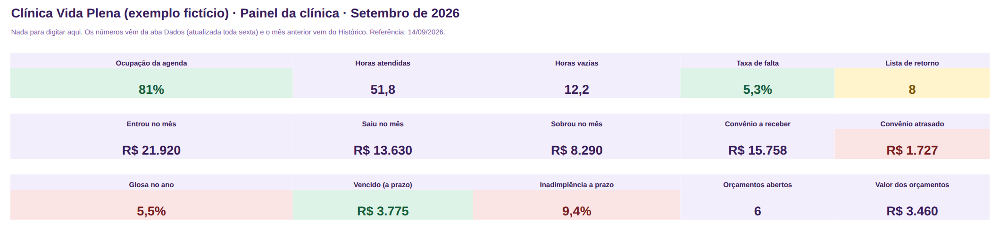

**Detalhe que importa:** é a planilha mais simples do kit de propósito: 14 números copiados à mão em
10 minutos, dos painéis das 01, 02, 09, 13, 14 e 15 (no exemplo, os da sexta 11/09: ocupação 81 %,
taxa de falta 5,3 %, entrou R$ 21.570, convênio a receber R$ 15.758 e atrasado R$ 1.727, vencido
R$ 4.550, 6 orçamentos abertos). Linha sem limite fica "Informativo". No meio do mês, agenda e caixa
estão parciais: a variação deles só aparece quando Config diz que o mês fechou. Fora do alvo
primeiro: convênio atrasado, vencido e glosa pedem ação na segunda (13, 14).

### 4.18 Resultado mensal (arquivo 18)
**Responde:** a clínica deu lucro de verdade neste mês, com qual margem, contra o anterior e o
previsto?
**Você preenche:** ano, mês de análise e % de impostos em Config; Resultado, por mês, a receita por
origem e cada linha de custo fixo, despesa variável e pró-labore (totais da 09); Previsto, o que espera
por mês.
**Sai:** receita, saídas, resultado e margem; comparação com o mês anterior e com o previsto
(variação da margem em p.p.); receita por origem; o ano com gráfico.
**Prompt:** Caixa 02 (comparar dois meses), Painel 02 (relatório para os sócios).

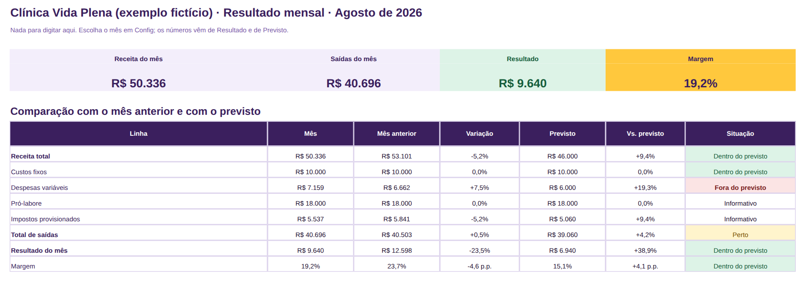

**Detalhe que importa:** DRE simplificada por regime de caixa: entra o recebido, sai o pago, e os
impostos entram como % da receita (11 %) para o resultado não parecer maior do que é. No exemplo,
agosto: receita R$ 50.336, custos fixos R$ 10.000, despesas variáveis R$ 7.159 (materiais, taxas de
cartão, repasse à parceira, manutenção), pró-labore R$ 18.000, impostos provisionados R$ 5.537, total
de saídas R$ 40.696, resultado R$ 9.640, margem 19,2 % (julho: 23,7 %). Retiradas extras, distribuição
de lucro e despesas pessoais ficam na 11, não aqui; por isso "Saiu no mês" do Caixa (R$ 41.620) é
diferente do "Total de saídas" da DRE. Meses futuros ficam em branco.

### 4.19 Metas do trimestre da clínica (arquivo 19)
**Responde:** estamos no ritmo para bater as metas do trimestre?
**Você preenche:** trimestre em Config; em Metas, até 3 objetivos com até 3 resultados-chave (ponto de
partida, meta, valor atual, dono, sentido); toda sexta, o valor atual e a coluna em Semanas.
**Sai:** atingidos, em risco, progresso médio; painel por objetivo; a lista completa com semáforo;
histórico de 13 semanas.
**Prompt:** Painel 05 (meta realista), Painel 06 (meta × realizado: explicar o desvio).

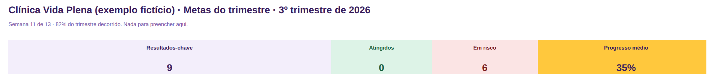

**Detalhe que importa:** o semáforo compara o progresso com o tempo decorrido: 100 % é "Atingido";
até 10 pontos abaixo, "No ritmo"; até 25, "Atenção"; além, "Em risco". Onde menor é melhor (taxa de
falta, glosa, inadimplência), a conta inverte sozinha. No exemplo, cada resultado-chave é um número
de outra planilha do kit (ocupação e falta da 01 e 02, glosa e prazo da 13, inadimplência da 14,
reserva da 12, provisão da 10): 9 resultados-chave, 6 em risco, progresso médio 35 % com 82 % do
trimestre decorrido. Meta em risco pede olhar a rotina (03) antes de mexer na meta.

### 4.20 Resumo do mês para a IA e para o contador (arquivo 20)
**Responde:** como foi o mês, indicador por indicador, em texto pronto para o sócio, o contador e a
IA?
**Você preenche:** mês em Config; em Indicadores, até 12 indicadores com meta, sentido, mês anterior e
mês atual (do Histórico da 17 e da 18); em Resumo, só a célula de observações.
**Sai:** o Painel com variação, meta e situação; a aba Resumo com as frases do mês, os destaques
automáticos e o **bloco único para copiar**.
**Prompt:** Painel 01 (explicar o mês ao sócio), Painel 02, Painel 03 (8 slides), Painel 04, Caixa 04
(contador).

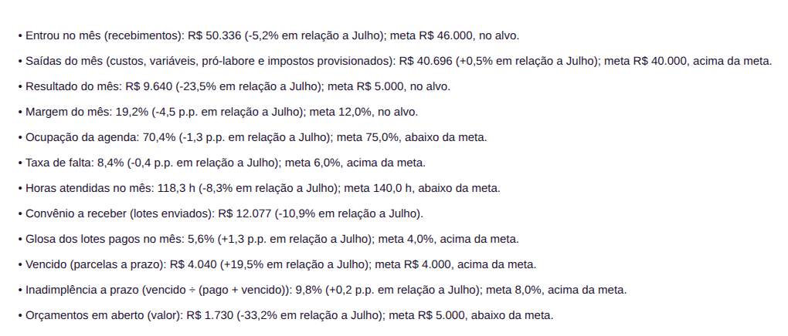

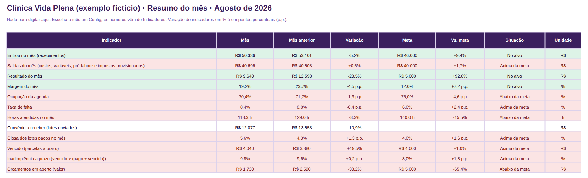

**Detalhe que importa:** o bloco só tem totais da clínica, sem paciente nem procedimento por pessoa:
é o único texto do kit pronto para colar na IA sem tratamento. Em %, digite 19,2 e não 0,192. Todo
mês, mova "Mês atual" para "Mês anterior" (o exemplo compara agosto com julho: 3 de 11 indicadores
com meta no alvo; a maior piora é a margem, −4,5 p.p.). A observação da clínica é o porquê dos
números, e também ela não leva nome de paciente.

## 5. Usar a IA com segurança (leia antes do primeiro prompt)

Os 40 prompts da biblioteca funcionam no ChatGPT, no Copilot, no Gemini e no Claude, inclusive nas
versões gratuitas. Cinco regras, na ordem em que importam:

1. **Nunca cole nome de paciente, contato ou qualquer dado de saúde em uma IA pública.** Nem CPF,
   carteirinha, número de guia com nome, motivo da consulta, exame, laudo, receita ou trecho de
   prontuário. Dado de saúde é sensível pela LGPD e o sigilo é seu; a IA pública não tem dever de
   sigilo e pode guardar o que recebe. Antes de colar, troque por "Paciente A", "Paciente B",
   "Convênio 1" e deixe só o que é gestão: procedimento (nome administrativo), valor, data, pagador,
   situação. Se o contexto ainda identifica alguém ("o único paciente de Holter da terça"), troque o
   contexto também. É a regra do guia LGPD (bônus 23, seção 6), e vale escrevê-la no termo de
   confidencialidade da equipe.
2. **Nenhum prompt do kit produz conteúdo clínico nem peça de divulgação.** Nada de conduta,
   diagnóstico, laudo, orientação de saúde ao paciente, texto para site, redes ou anúncio. São
   prompts de gestão: explicar o mês, escrever a cobrança educada, resumir os convênios, preparar a
   reunião com o contador, revisar a tabela de preços, montar a rotina da recepção. Mensagens ao
   paciente são de rotina administrativa; se uma delas for para muita gente de uma vez, revise pelas
   regras do CFM/CRM antes.
3. **A IA erra com confiança.** Todo número, data e conclusão que ela escreve passa por você antes de
   virar mensagem, tabela de preços ou decisão. Cada prompt diz o que conferir. Se a IA afirmar um
   dado que não estava no bloco colado, apague.
4. **Contexto é o segredo.** Os prompts começam com quem lê, para quê e o que você já tem. Se a
   resposta vier ruim, não reescreva o prompt: responda "Refaça: [o que faltou]".
5. **O bloco da planilha 20 é o único pronto para colar.** As tabelas dos outros painéis podem trazer
   coluna de paciente: passe pela regra 1 antes. A tabela "De onde vem cada bloco", na abertura da
   biblioteca, diz qual aba copiar para cada prompt.

Guarde os prompts que funcionaram, com as suas adaptações. O modelo em branco no fim da biblioteca
serve para criar os seus.

## 6. A rotina

Depois das quatro semanas, é isto: trinta minutos por semana, um fechamento por mês, meia tarde por
trimestre. Mais o que a recepção faz todo dia: 3 minutos na abertura e 10 no fechamento (planilha 04).

**Segunda, 12 minutos (agenda), com a recepção.** Agenda (01): vagas dos próximos 7 dias e ocupação
da semana. Confirmações da semana por mensagem (modelo 02 do bônus 22). Lista de retorno (02): ligar
ou mandar mensagem (modelo 05) e oferecer as vagas. Faltas da semana passada: registrar e remarcar
(modelo 03). Parcelas (14): marcar as pagas e enviar as mensagens de "Cobrar primeiro" (modelos 09 a
12). Rotina (03): marcar Sim. Prompts: Agenda 01 quando a ocupação cair; Recebíveis 02 quando a lista
de cobrança for longa.

**Sexta, 18 minutos (caixa e painel).** Caixa (09): lançar os fechamentos do dia da semana, marcar
Sim nas parcelas e lotes que caíram, conferir A receber contra o extrato. Convênios (13): separar as
guias da semana e atualizar os lotes. Orçamentos (15): etapas e retomadas. Conciliação (16): conferir
o que caiu da operadora. Painel da clínica (17): copiar os totais para Dados e anotar até três
decisões. Metas (19) e Reserva (12): valor atual. Rotina (03): marcar Sim. Prompt: Agenda 08 para
fechar a semana em texto.

**Dia 5, 1 hora e meia (fechamento do mês).** Na ordem: Caixa (09) conciliado com o extrato e as taxas
de cartão do mês lançadas (16); lote de convênio do mês anterior enviado e registrado (13); Provisão
(10) com as entradas e a transferência para a conta separada; Repasse (11) calculado sobre a
produção do parceiro no Painel da 01, para pagar no dia 10, e retiradas dos sócios lançadas; Reserva
(12) com o aporte; Resultado mensal (18); Painel (17) com a linha do mês em Histórico; Resumo do mês
(20) com os 12 indicadores e a observação. Checklist "Fechamento do mês" (25). Depois, o bloco único
da 20 nos prompts Painel 01 (sócio) e Caixa 04 (contador), a reunião de 30 minutos do bônus 24 (com o
modelo 29, só totais) e, se houver reunião de sócios, o modelo 27 com o Painel 03.

**Fim do trimestre, meia tarde.** Metas (19): fechar e definir as próximas com o Painel 05.
Repasse e pró-labore (11): distribuição do lucro pela regra. Custo da hora (05), Precificação (06) e
Tabela de preços (08): revisar com as horas atendidas e o volume real. Simulador (07): os convênios
que vencem contrato, com o Preço 03. Orçamentos (15): motivos de recusa com o Recebíveis 05. Painel 04
para as perguntas difíceis; Painel 07 se a conversa for trazer um parceiro ou abrir um turno.

**Quando entra um médico parceiro, 20 minutos.** Turnos e sala na Config da 01; linha em Equipe da 05
(não entra no custo-hora); parceiro na Config da 11 com % de repasse, base e dia de pagamento; modelo
28 para a proposta; como formalizar, com o contador (bônus 24).

**Antes de aceitar ou renovar um convênio, 30 minutos.** Tabela na Precificação (06); Simulador (07)
nas duas leituras; horas vazias na Agenda (01); Preço 03 e Preço 08; checklist "Antes de fechar um
convênio" (25); convênio na Config das 01, 06, 07, 08, 09 e 13, escrito igual.

## 7. Erros comuns e como resolver

| Sintoma | Causa provável | O que fazer |
|---|---|---|
| Painel zerado | Mês ou ano em Config diferente dos lançamentos | Confira Config; os lançamentos precisam ter data no mês e no ano do painel |
| Ocupação acima de 100 % ou horas disponíveis zeradas | Turno cadastrado sem sala ou sem período em Config da 01; feriado não cadastrado | Confira a tabela de turnos (dia, período, sala, profissional) e os feriados; horas disponíveis só contam dias já passados |
| "#NOME?" em uma coluna | Arquivo aberto em um programa antigo (Excel anterior a 2007) ou em um aplicativo que não tem alguma função | Abra no Excel 2016 ou mais novo, no Microsoft 365 ou no Google Sheets |
| Lista suspensa não abre | Validação perdida ao colar de outra planilha, ou lista de Config com linha vazia no meio | Cole só valores (Colar especial > Valores); em Config, preencha de cima para baixo sem pular linha |
| Paciente não aparece na lista da 14 ou da Agenda | Cadastrado com nome diferente do que está em Pacientes da 01 | Copie a lista de Pacientes da 01 de novo; o texto precisa ser idêntico |
| Convênio não aparece em uma planilha | Nome escrito diferente do que está nas outras (Saúde Total × Saude Total) | Escreva o nome igual em Config das 01, 06, 07, 08, 09 e 13 |
| Custo-hora alto demais | Recepção contada duas vezes (Custos fixos e Equipe), ou médico parceiro contado nas horas | Marque "Sim" em "Já está nos custos fixos?"; parceiro por repasse não entra no custo-hora |
| Hora mínima em branco | Margem + impostos somam 100 % ou mais em Config | Revise os percentuais; a soma precisa ficar abaixo de 100 % |
| Caixa não bate com o extrato | Lançamento com Pago? = Não, taxas de cartão não lançadas, ou movimento pessoal do sócio lançado como despesa | Confira A receber e A pagar; lance o total da 16 no fim do mês; movimentos dos sócios vão para a planilha 11 |
| Lote pago e o caixa não subiu | Entrada do lote ainda com Pago? = Não, ou lançada pelo valor enviado em vez do pago | Troque para Sim e ajuste o valor pela glosa; a glosa não entra no caixa |
| Repasse diferente do que o parceiro calculou | Produção do parceiro na 11 diferente do Painel da 01, ou base combinada (produção × recebido) diferente | Copie a produção do Painel da 01 com o mês certo; confira a base em Config da 11 |
| Provisão zerada | Alíquota em branco em Config, ou entradas não lançadas | Peça a alíquota efetiva ao contador e lance as entradas do mês |
| Percentual estranho no Resumo do mês | Digitou 0,192 em vez de 19,2 | Em Indicadores, percentuais são digitados como 19,2 |
| Progresso maior que 100 % nas Metas | Meta igual ao ponto de partida | Meta e ponto de partida precisam ser diferentes |
| Data virou número | Célula formatada como número | Selecione a coluna e mude o formato para data |
| Fórmula sumiu | Você digitou por cima de uma célula branca | Desfaça (Ctrl+Z) ou baixe o arquivo original de novo |
| Gráfico não atualiza no Sheets | Intervalo do gráfico não pegou as linhas novas | Clique no gráfico > editar > amplie o intervalo |
| Datas do exemplo mudaram sozinhas | É de propósito: agenda futura, vencimentos em aberto e orçamentos abertos do exemplo são relativos a hoje | Apague o exemplo e digite os seus |

## 8. Suporte e reembolso

Suporte por e-mail, para acesso, arquivos e dúvidas deste manual:
**suporte@seusociogestor.com.br**, resposta em até 5 dias úteis. Sem telefone, sem WhatsApp. Não é
consultoria: não preenchemos os seus dados, não analisamos a sua clínica e não respondemos dúvida
clínica, jurídica, tributária ou contábil. Alíquota, regime, formalização do repasse e regras de
divulgação são assunto do seu contador, do seu jurídico e do seu CRM.

Direito de arrependimento de 7 dias, pela página do pedido ou pelo mesmo e-mail, sem explicar. O
valor volta pelo mesmo meio.

ZTRAINING SERVICE LTDA · CNPJ 68.796.613/0001-10 · seusociogestor.com.br
